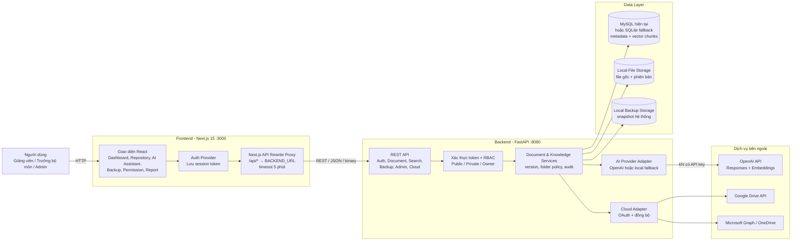
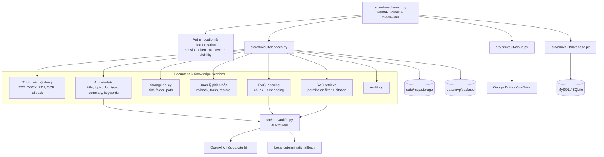
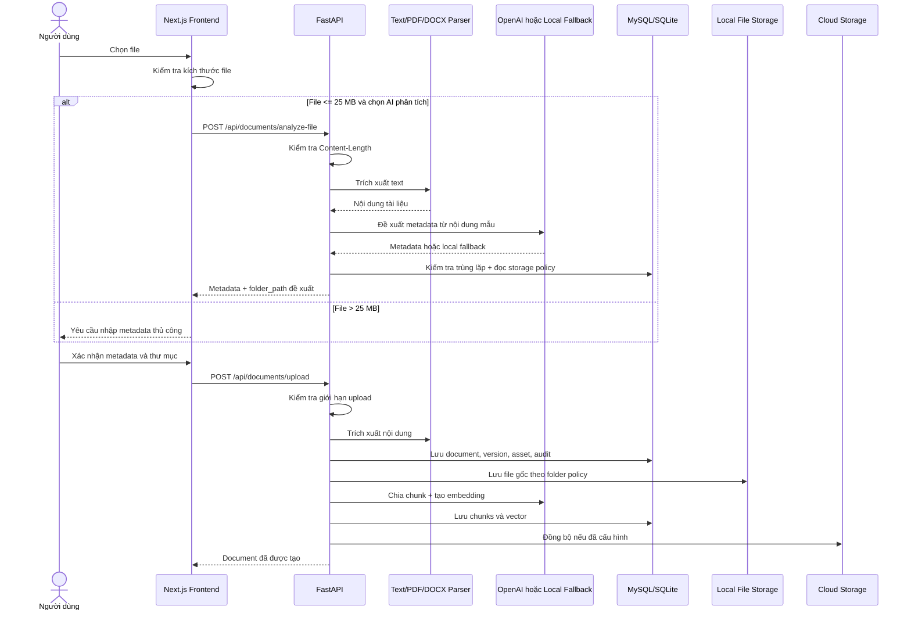
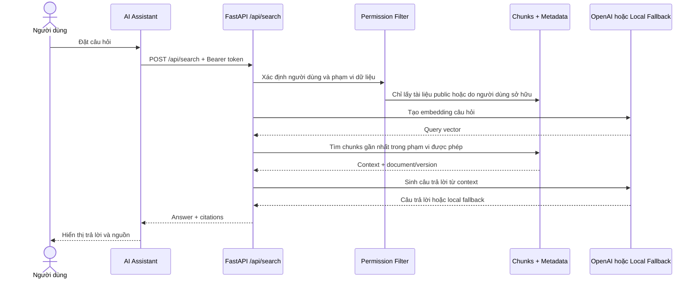
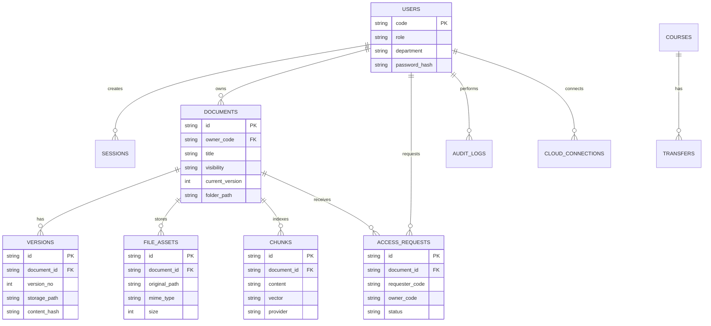
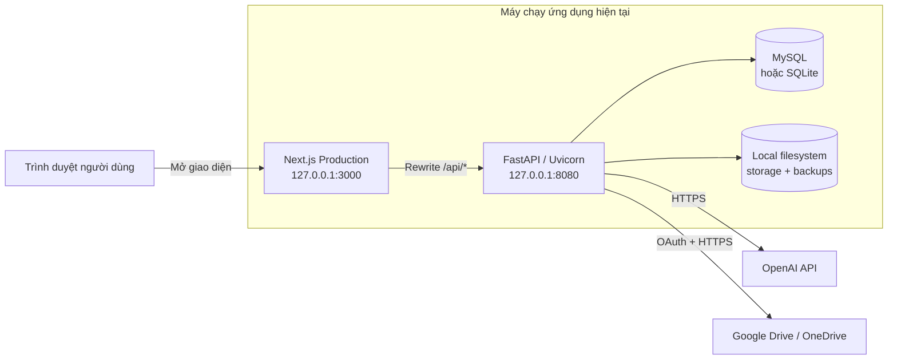
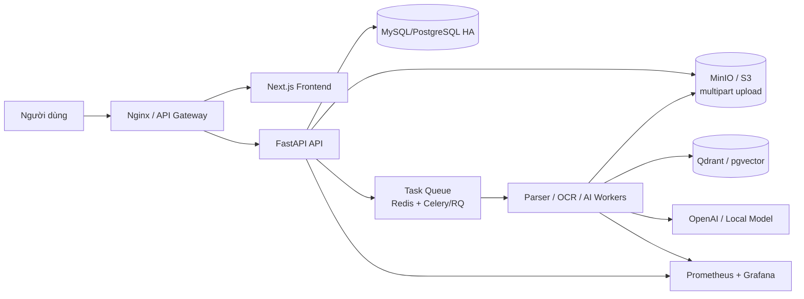

# Kiến trúc hệ thống EduVault hiện tại

Tài liệu này mô tả kiến trúc đang được triển khai trong mã nguồn hiện tại của
EduVault. Các thành phần nét liền là thành phần đã có; các thành phần trong phần
"Hướng nâng cấp production" chưa được triển khai đầy đủ.

## 1. Sơ đồ kiến trúc tổng thể



## 2. Kiến trúc backend theo thành phần



## 3. Luồng upload và phân tích tài liệu

Hệ thống hiện chia giới hạn file thành hai tầng:

- AI phân tích trực tiếp: tối đa `MAX_AI_ANALYZE_MB`, mặc định `25 MB`.
- Lưu file gốc: tối đa `MAX_UPLOAD_MB`, hiện cấu hình `250 MB`.
- File vượt giới hạn AI vẫn có thể được lưu nếu người dùng nhập metadata thủ công.



## 4. Luồng hỏi đáp RAG

Quyền truy cập được lọc trước khi retrieval. AI không tự cấp quyền và không
được nhận nội dung private ngoài phạm vi người dùng.



## 5. Mô hình dữ liệu logic



## 6. Sơ đồ triển khai hiện tại



Lệnh chạy hiện tại:

```powershell
# Backend
python run_mvp.py

# Frontend
cd frontend
npm run build
npm start
```

## 7. Policy và ranh giới an toàn

- Frontend gửi token qua header `Authorization: Bearer ...`.
- Backend kiểm tra token, vai trò, chủ sở hữu và visibility trước khi xử lý.
- AI không được cấp quyền truy cập và không tự thay đổi quyền tài liệu.
- Tài liệu private của người khác bị loại khỏi phạm vi RAG trước retrieval.
- Chủ sở hữu tài liệu private được ẩn danh với người dùng khác.
- Folder do AI/policy đề xuất phải được người dùng xác nhận.
- Khi OpenAI lỗi hoặc chưa cấu hình, metadata, embedding và RAG dùng local
  fallback để hệ thống vẫn hoạt động.
- File lớn được từ chối sớm trước khi backend đọc toàn bộ request vào RAM.
- OAuth token của cloud provider được mã hóa trước khi lưu.

Policy thư mục mặc định:

```text
{department}/{topic}/{doc_type}/{visibility}
```

Ví dụ:

```text
Công nghệ thông tin/Học máy/Học liệu/public/
```

## 8. Hướng nâng cấp production

Kiến trúc hiện tại phù hợp MVP chạy trên một máy. Để triển khai production và
xử lý tài liệu lớn ổn định, nên nâng cấp theo sơ đồ sau:



Các thay đổi quan trọng:

1. Upload file lớn trực tiếp vào MinIO/S3 bằng multipart hoặc presigned URL.
2. Đưa parse, OCR, embedding và indexing vào hàng đợi xử lý nền.
3. Frontend theo dõi trạng thái `uploaded → parsing → indexing → ready/failed`.
4. Tách vector store khỏi bảng SQL khi khối lượng chunks tăng cao.
5. Bổ sung reverse proxy, HTTPS, secrets manager, rate limit và monitoring.
6. Chạy backup/restore định kỳ và kiểm tra tuân thủ 3-2-1 tự động.
