# Hệ thống kho lưu trữ tri thức

## EduVault V2 demo

V2 giữ toàn bộ chức năng MVP cũ và bổ sung kiến trúc hybrid cho một khoa:

- MySQL 8.4 làm system of record; tự chuyển sang SQLite fallback nếu MySQL chưa chạy.
- MinIO lưu file gốc và version; local object-store làm fallback demo.
- Qdrant lưu vector; chunk trong database làm fallback.
- Redis nhận job từ transactional outbox; xử lý đồng bộ làm fallback.
- Trạng thái xử lý V2, object reference, outbox và chính sách công bố đề thi.
- Dashboard hiển thị trực tiếp dịch vụ V2 đang hoạt động hay fallback.

Chạy demo nhanh:

```powershell
.\run_v2_demo.ps1
```

Chạy đầy đủ MySQL/MinIO/Redis/Qdrant:

```powershell
docker compose -f docker-compose.v2.yml up -d
```

Xem [hướng dẫn demo V2](V2_DEMO.md) và
[kiến trúc V2](eduvault_architecture_flows_v2.md).

## EduVault MVP hoàn chỉnh

Phiên bản MVP mới sử dụng FastAPI + SQLite và lưu trữ file cục bộ. Hệ thống bao gồm:

- Xác thực bằng token và phân quyền theo vai trò.
- Kho tài liệu Public/Private có kiểm tra quyền trước khi truy xuất.
- Upload/kéo-thả file gốc tối đa 25 MB, lưu file theo phiên bản và tải xuống theo quyền.
- AI metadata mô phỏng, phát hiện nội dung trùng lặp và hỏi đáp có trích dẫn.
- AI provider tự chuyển giữa local fallback và OpenAI Responses API.
- Policy tự đề xuất/tạo cây thư mục theo metadata; người dùng xác nhận nơi lưu trước khi ghi file.
- Lưu phiên bản tài liệu vật lý, xem lịch sử và rollback.
- Quy trình yêu cầu/phê duyệt quyền truy cập tài liệu Private.
- Audit log và tạo snapshot backup bởi quản trị viên.
- Giao diện web responsive cho giảng viên, trưởng bộ môn và quản trị viên.
- Tiếp nhận học phần/quy trình, chuyển giao tri thức, giám sát chất lượng và báo cáo sử dụng.
- Quản lý policy, người dùng, kho lưu trữ ngoài và kiểm tra tuân thủ 3-2-1.

Xem [hướng dẫn sử dụng](USE_.md), [pipeline chatbot](RAG_PIPELINE.md), [kiểm tra yêu cầu tối thiểu](MINIMUM_REQUIREMENTS_AUDIT.md), [ma trận triển khai](USE_CASE_COVERAGE.md) và [thiết kế AI](AI_ARCHITECTURE.md).

### Chạy MVP

```powershell
python run_mvp.py
```

Mở `http://127.0.0.1:8080`. Mật khẩu mặc định giống mã người dùng:

| Mã / mật khẩu | Vai trò |
| --- | --- |
| `GV001` | Giảng viên |
| `GVNEW` | Giảng viên mới |
| `TBM01` | Trưởng bộ môn |
| `ADMIN` | Quản trị viên |

API documentation: `http://127.0.0.1:8080/docs`.

### Kiểm thử

```powershell
python -m pytest -q
```

Dữ liệu MVP nằm trong `data/mvp/`:

- `eduvault.db`: cơ sở dữ liệu SQLite.
- `storage/`: nội dung từng phiên bản tài liệu.
- `storage/repository/`: file gốc được xếp theo cây thư mục do policy tạo.
- `backups/`: snapshot cơ sở dữ liệu và storage.

### Giới hạn trước Production

MVP chạy độc lập trên một máy. Trước khi triển khai production cần thay SQLite/local storage bằng PostgreSQL/MinIO, sử dụng SSO hoặc mật khẩu băm mạnh, tích hợp OCR/parser, HTTPS, hàng đợi tác vụ và các adapter Google Drive/OneDrive/SharePoint thật.

### Bật OpenAI sau khi có key

Tạo file `.env` từ `.env.example`, sau đó điền:

```text
OPENAI_API_KEY=...
OPENAI_MODEL=gpt-5.4-mini
```

Khởi động lại `python run_mvp.py`. Endpoint `/api/ai/status` cho biết hệ thống đang chạy `local` hay `openai`.

## Chạy thử Demo V1

Demo V1 mô phỏng các luồng cốt lõi của EduVault mà không cần cài thêm dependency:

- Đăng nhập theo bốn vai trò.
- Dashboard kho tri thức.
- Xem, tìm kiếm và lọc tài liệu theo quyền truy cập.
- Upload tài liệu, AI demo đề xuất metadata và lập chỉ mục.
- Hỏi đáp tài liệu kèm nguồn tham khảo.
- Theo dõi trạng thái backup 3-2-1.

Yêu cầu: Python 3.10 trở lên.

```powershell
python web_demo.py
```

Mở `http://127.0.0.1:8000`, sau đó sử dụng một trong các mã:

| Mã | Vai trò |
| --- | --- |
| `GV001` | Giảng viên |
| `GVNEW` | Giảng viên mới |
| `TBM01` | Trưởng bộ môn |
| `ADMIN` | Quản trị viên |

Dữ liệu demo được tạo tại `data/demo_state.json` trong lần chạy đầu tiên.

## Project Brief

I. Tên dự án:

AI Knowledge Repository System

II. Vấn đề

Các khoa tại các trường đại học phải lưu trữ một lượng lớn tài liệu như đề cương môn học, học liệu, biên bản, hồ sơ kiểm định, kinh nghiệm giảng dạy qua nhiều năm. Tuy nhiên các tài liệu này được lưu không thống nhất nơi lưu trữ với nhau. ĐIều này đã dẫn đến rất nhiều hệ quả như:

- Mất rất nhiều thời gian để truy xuất thông tin tài liệu, đặc biệt là tìm các tài liệu liên quan
- Việc truy xuất lịch sử thay đổi tài liệu khó khăn
- Giảng viên mới về trường gặp rất nhiều khó khăn trong việc tìm hiểu quy trình và các loại thủ tục
- Tri thức có thể bị mất khi giảng viên nghỉ hưu hoặc chuyển công tác

III. Giải pháp

Xây dựng một hệ thống kho lưu trữ tri thức tập chung có sự kết hợp với AI để giải quyết các vấn đề trên thông qua việc thiết kế trợ lý ảo hỗ trợ tìm kiếm, lưu trữ và backup tài liệu giảng dạy theo mô hình file và folder

IV. Đối tượng người dùng

Hệ thống sẽ tập chung phục vụ cho các giảng viên trong khoa 

V. Giá trị khác biệt

Khác với các khoa lưu trữ hiện nay đang có trên thị trường, hệ thống này biến tàn bộ kho tài liệu của khoa thành một kho tri thức có thể đối thoại được.  tính năng tiêu biểu nhất là:

- Thiết lập chính sách lưu trữ, backup và phân quyền tài liệu
- Trợ lý ảo import tài liệu giảng viên đưa lên
- Trợ lý ảo hỏi đáp tài liệu
- Rollback

# PRD_EduVault

Product Requirements Document

Web app AI lưu trữ, phân loại và truy xuất kho tài liệu của khoa qua chatbot, kèm trích dẫn nguồn và phân quyền Public/Private.

## 01 Mục tiêu sản phẩm

- Một **kho tri thức tập trung** theo mô hình file & folder, thay cho dữ liệu phân tán.
- Giảng viên **thả file lên — AI tự lo phần còn lại**: đọc, trích xuất, nhận diện chủ đề, gắn metadata, đề xuất nơi lưu.
- **Truy xuất bằng hội thoại**: hỏi tự nhiên bằng tiếng Việt, AI trả lời kèm trích dẫn và vị trí file.
- **Phân quyền Public/Private** ở mức metadata — AI không bao giờ tự ý tiết lộ dữ liệu của chủ sở hữu.
- **An toàn dữ liệu**: chính sách sao lưu 3-2-1 và khả năng khôi phục (rollback) phiên bản tài liệu.

**Chỉ số thành công chính (north-star):** rút ngắn rõ rệt thời gian truy xuất một tài liệu/thông tin so với quy trình thủ công hiện tại.

## 02 User Roles

| Vai trò | Mô tả | Quyền chính |
| --- | --- | --- |
| Giảng viên | Người dùng cốt lõi của hệ thống. | Upload tài liệu, đặt câu hỏi truy xuất, đặt mức Public/Private cho tài liệu của mình, duyệt yêu cầu truy cập dữ liệu Private của mình. |
| Trưởng bộ môn | Giám sát kho tri thức của bộ môn. | Toàn bộ quyền của giảng viên + xem tài liệu Public trong phạm vi bộ môn, theo dõi danh mục. |
| Quản trị hệ thống | Thiết kế & vận hành kho. | Thiết kế cấu trúc kho, tạo danh mục, thiết lập phân quyền theo mã giảng viên, cấu hình chính sách backup, xác nhận các thao tác lưu trữ (HITL). |

**Đăng nhập:** mọi vai trò xác thực qua **mã giảng viên / mã được cấp**, không tự đăng ký công khai.

## 03 Core User Stories

| Mã | User Story | Tiêu chí nghiệm thu |
| --- | --- | --- |
| US-01 | Là **giảng viên**, tôi muốn đăng nhập bằng mã được cấp để vào hệ thống an toàn. | Đăng nhập thành công bằng mã hợp lệ; phiên/token được bảo vệ; sai mã bị từ chối. |
| US-02 | Là giảng viên, tôi muốn **thả file lên** để AI tự xử lý mà không cần điền tay nhiều. | Upload thành công; AI **đề xuất sẵn** chủ đề, loại tài liệu, tác giả, mức bảo mật; giảng viên chỉ cần xác nhận/sửa. |
| US-03 | Là giảng viên, tôi muốn AI **tự phân loại & lưu** tài liệu vào đúng kho cùng chủ đề. | Mỗi tài liệu có metadata (chủ đề, loại, tác giả, thời gian, Public/Private); file được xếp vào folder chủ đề tương ứng; tài liệu trùng nội dung được cảnh báo/loại bỏ. |
| US-04 | Là giảng viên, tôi muốn **hỏi đáp tài liệu bằng tiếng Việt** và nhận câu trả lời có nguồn. | Chatbot trả lời dựa trên tài liệu trong kho, kèm **trích dẫn nguồn + vị trí file**; chỉ dùng dữ liệu giảng viên được phép xem. |
| US-05 | Là giảng viên, khi cần một tài liệu **Private** của đồng nghiệp, tôi muốn xin quyền truy cập đúng quy trình. | AI cung cấp thông tin liên hệ tác giả và **gửi yêu cầu xác nhận**; chỉ khi tác giả đồng ý mới được tải. |
| US-06 | Là **quản trị**, tôi muốn thiết lập danh mục, cấu trúc kho và phân quyền theo mã giảng viên. | Tạo/sửa danh mục & folder; gán quyền theo từng use case & mã giảng viên; thay đổi có hiệu lực ngay. |
| US-07 | Là giảng viên, tôi muốn **khôi phục** phiên bản trước của tài liệu khi cần. | Xem lịch sử phiên bản; rollback về bản trước; thao tác được ghi log. |
| US-08 | Là quản trị, tôi muốn dữ liệu được **sao lưu an toàn** để không mất khi sự cố. | Chính sách backup 3-2-1 hoạt động; bảng trạng thái backup hiển thị đủ 3 bản / 2 nơi / ≥1 bản ngoài. |

Đây là 8 US trọng tâm cho Gate 1 & MVP. Danh sách đầy đủ (~28 US) được quản lý trong file Project Management của nhóm.

## 04 Top 3 tính năng

Ba tính năng cốt lõi của sản phẩm

1. **AI lưu trữ & phân loại tự động khi upload.**
Đọc nội dung → nhận diện chủ đề & loại tài liệu → gắn metadata → đề xuất nơi lưu → tự xếp vào kho cùng chủ đề (có xác nhận của quản trị).
2. **Truy xuất bằng hội thoại (chatbot RAG).**
Giảng viên hỏi tự nhiên, AI tìm tài liệu liên quan nhất và trả lời kèm trích dẫn nguồn + vị trí file.
3. **Phân quyền phạm vi dữ liệu (Public/Private).**
Quyền truy cập gắn ở metadata theo mã giảng viên; dữ liệu Private cần tác giả xác nhận mới mở.

## 05 Yêu cầu chức năng

### Xác thực & Phân quyền

- Đăng nhập bằng mã giảng viên / mã cấp
- 3 vai trò: Giảng viên · Trưởng bộ môn · Quản trị
- Quyền gán theo use case & mã giảng viên

### Upload & Import tài liệu

- Form kéo-thả nhiều định dạng (PDF, DOCX, …)
- AI đề xuất metadata: chủ đề, loại, tác giả, thời gian
- Giảng viên chọn mức Public/Private

### AI Enrichment

- Đọc nội dung & trích xuất thông tin
- Nhận diện chủ đề + xác định loại tài liệu
- Phát hiện trùng lặp → cảnh báo/loại bỏ
- Sinh metadata có cấu trúc (validate)

### Kho lưu trữ (file/folder)

- Cây thư mục theo danh mục/chủ đề
- Tự xếp file vào kho cùng chủ đề
- Quản trị thiết kế cấu trúc & danh mục

### Truy xuất & Hỏi đáp

- Chatbot tiếng Việt (RAG)
- Trả lời kèm trích dẫn + vị trí file
- Kiểm tra trạng thái Public/Private trước khi trả
- Private → gửi yêu cầu xác nhận tới tác giả

### Backup & Khôi phục

- Chính sách 3-2-1 (3 bản · 2 nơi · ≥1 ngoài)
- Lịch sử phiên bản tài liệu
- Rollback / khôi phục bản trước

**Luồng phụ quan trọng:** khi giảng viên về hưu hoặc chuyển công tác, tài liệu của họ được chuyển trạng thái sang **Public** để tránh thất thoát tri thức.

## 06 Luồng xử lý AI (AI Workflow)

### Pipeline khi upload (Auto-classify & Store)

1.  Ingest (Nhận file, tách text/OCR)
2. Hiểu nội dung (Trích xuất, nhận diện chủ đề & loại)
3. Gắn metadata:
    - Chủ đề
    - Tác giả
    - Thời gian
    - Bảo mật
4. Đề xuất + HITL (Đề xuất nơi lưu, quản trị xác nhận)
5. Index (Embedding → vector DB + lưu file)

### Pipeline khi hỏi đáp (Retrieval Q&A)

1. Câu hỏi (Giảng viên hỏi tiếng Việt)
2. Retrieve (Tìm tài liệu liên quan nhất)
3. Gate quyền (Public → trả · Private → xin phép)
4. Trả lời (Đáp án + trích dẫn + vị trí file)

**Ranh giới AI (an toàn):** AI **không tự cấp quyền** và **không tiết lộ dữ liệu Private** của chủ sở hữu. Thao tác lưu trữ vào kho cần **người quản trị xác nhận (Human-in-the-loop)**.

## 07 Mô hình dữ liệu (tối giản)

```
# documents — tài liệu & metadata
documents:
  - id
  - owner_code        # mã giảng viên sở hữu
  - title
  - doc_type           # đề cương | học liệu | biên bản | quy trình | kinh nghiệm
  - topic / subtopic
  - author, created_at
  - visibility          # public | private
  - folder_id
  - storage_uri        # vị trí file vật lý
  - current_version

# versions — lịch sử để rollback
versions:
  - id, document_id, version_no, storage_uri, created_at

# access_requests — xin quyền tài liệu private
access_requests:
  - id, document_id, requester_code, status   # pending|approved|denied

# chunks — phục vụ RAG
chunks:
  - id, document_id, content, vector, page_ref
```

## 08 API chính

| Endpoint | Method | Mục đích | Response chính |
| --- | --- | --- | --- |
| /api/auth/login | POST | Đăng nhập bằng mã | token, user, role |
| /api/documents | POST | Upload tài liệu | document_id, suggested_metadata |
| /api/documents/{id}/confirm | POST | Xác nhận metadata & lưu (HITL) | status, folder_id |
| /api/search | POST | Hỏi đáp / truy xuất (RAG) | answer, citations, file_locations |
| /api/access-requests | POST | Xin quyền tài liệu private | request_id, status |
| /api/documents/{id}/rollback | POST | Khôi phục phiên bản | restored_version |
| /api/admin/permissions | PUT | Phân quyền theo mã giảng viên | updated_rules |

## 09 Tech Stack dự kiến

### Frontend

- React / Vue
- Giao diện chat + cây thư mục

### Backend

- Python (FastAPI) hoặc Node.js
- API + xác thực + phân quyền

### AI / RAG

- LLM API + embedding
- Vector DB (pgvector / Chroma / Qdrant)
- Prompt engineering, validate JSON

### Lưu trữ & Backup

- SQL (Postgres) cho metadata
- Object storage cho file
- Backup 3-2-1, lưu phiên bản

# Phân tích thiết kế hệ thống

```mermaid
flowchart LR

%% =========================
%% ACTORS
%% =========================

User["Người dùng hệ thống"]

Lecturer["Giảng viên"]
NewLecturer["Giảng viên mới"]
Head["Trưởng bộ môn"]
Admin["Quản trị viên"]

User --> Lecturer
User --> NewLecturer
User --> Head
User --> Admin

GoogleDrive["Google Drive"]
OneDrive["OneDrive"]
SharePoint["SharePoint"]

%% =========================
%% SYSTEM
%% =========================

subgraph AIKRS["AI Knowledge Repository System"]

%% Authentication
UC00(("Đăng nhập"))
UC001(("Xác thực người dùng"))

%% =========================
%% GIẢNG VIÊN
%% =========================

UC01(("Lưu trữ tài liệu"))
UC011(("Phân tích tài liệu"))
UC012(("Trích xuất metadata"))
UC013(("Đề xuất vị trí lưu trữ"))
UC014(("Xác nhận vị trí lưu trữ"))
UC015(("Đồng bộ kho lưu trữ ngoài"))

UC02(("Tìm kiếm tài liệu"))
UC021(("Tra cứu nguồn gốc tài liệu"))

UC03(("Hỏi đáp tri thức"))
UC031(("Hiển thị nguồn tham khảo"))

UC04(("Xem lịch sử tài liệu"))
UC041(("Khôi phục phiên bản"))

UC16(("Xem quyền truy cập tài liệu"))

%% =========================
%% GIẢNG VIÊN MỚI
%% =========================

UC05(("Tiếp nhận học phần"))
UC051(("AI tổng hợp tri thức học phần"))

UC06(("Tiếp nhận quy trình"))
UC061(("AI tổng hợp quy trình công tác"))

%% =========================
%% TRƯỞNG BỘ MÔN
%% =========================

UC07(("Quản lý phân quyền"))

UC08(("Khởi tạo chuyển giao học phần"))

UC09(("Theo dõi tiến độ chuyển giao"))

UC10(("Giám sát chất lượng kho tri thức"))
UC101(("Phát hiện tài liệu lỗi thời"))
UC102(("Phát hiện tài liệu trùng lặp"))
UC103(("Phát hiện học phần thiếu tài liệu"))

UC11(("Xem báo cáo sử dụng kho tri thức"))

UC15(("Kiểm tra tuân thủ 3-2-1"))
UC151(("Kiểm tra số lượng bản sao"))
UC152(("Kiểm tra lưu trữ ngoài hệ thống"))
UC153(("Kiểm tra trạng thái backup"))

%% =========================
%% QUẢN TRỊ VIÊN
%% =========================

UC12(("Quản lý Policy"))
UC121(("Thiết lập quy tắc lưu trữ"))
UC122(("Thiết lập quy tắc phân quyền"))
UC123(("Thiết lập quy tắc backup"))

UC13(("Quản lý Backup"))
UC131(("Khôi phục hệ thống"))
UC132(("Cấu hình kho lưu trữ ngoài"))
UC133(("Theo dõi trạng thái đồng bộ"))

UC14(("Quản lý người dùng"))
UC141(("Tạo tài khoản"))
UC142(("Cập nhật tài khoản"))
UC143(("Khóa tài khoản"))
UC144(("Gán vai trò người dùng"))

end

%% =========================
%% ACTOR RELATIONSHIPS
%% =========================

User --> UC00

Lecturer --> UC01
Lecturer --> UC02
Lecturer --> UC03
Lecturer --> UC04
Lecturer --> UC16

NewLecturer --> UC05
NewLecturer --> UC06
NewLecturer --> UC03
NewLecturer --> UC04

Head --> UC07
Head --> UC08
Head --> UC09
Head --> UC10
Head --> UC11
Head --> UC15

Admin --> UC12
Admin --> UC13
Admin --> UC14

%% =========================
%% INCLUDE
%% =========================

UC00 -.include.-> UC001

UC01 -.include.-> UC011
UC01 -.include.-> UC012
UC01 -.include.-> UC013
UC01 -.include.-> UC014
UC01 -.include.-> UC015

UC03 -.include.-> UC031

UC05 -.include.-> UC051

UC06 -.include.-> UC061

UC10 -.include.-> UC101
UC10 -.include.-> UC102
UC10 -.include.-> UC103

UC15 -.include.-> UC151
UC15 -.include.-> UC152
UC15 -.include.-> UC153

UC12 -.include.-> UC121
UC12 -.include.-> UC122
UC12 -.include.-> UC123

UC13 -.include.-> UC132
UC13 -.include.-> UC133

UC14 -.include.-> UC141
UC14 -.include.-> UC142
UC14 -.include.-> UC143
UC14 -.include.-> UC144

%% =========================
%% EXTEND
%% =========================

UC021 -.extend.-> UC02

UC041 -.extend.-> UC04

UC131 -.extend.-> UC13

%% =========================
%% EXTERNAL STORAGE
%% =========================

GoogleDrive --> UC015
OneDrive --> UC015
SharePoint --> UC015

GoogleDrive --> UC132
OneDrive --> UC132
SharePoint --> UC132
```


# ĐẶC TẢ USE CASE – ACTOR GIẢNG VIÊN

---

# UC01 – Lưu trữ tài liệu

## Mục tiêu

Cho phép giảng viên lưu trữ tài liệu vào kho tri thức theo đúng chính sách của khoa và nguyên tắc quản lý tri thức.

## Actor

* Giảng viên

## Tiền điều kiện

* Người dùng đã đăng nhập.
* Người dùng có quyền lưu tài liệu.

## Hậu điều kiện

* Tài liệu được lưu thành công.
* Metadata được tạo.
* Tài liệu được đồng bộ tới các kho lưu trữ theo chính sách.

## Quan hệ

### Include

* UC01.1 Phân tích tài liệu
* UC01.2 Trích xuất metadata
* UC01.3 Đề xuất vị trí lưu trữ
* UC01.4 Xác nhận vị trí lưu trữ
* UC01.5 Đồng bộ kho lưu trữ ngoài

## Luồng chính

1. Giảng viên chọn chức năng Lưu trữ tài liệu.
2. Tải tài liệu lên hệ thống.
3. Hệ thống phân tích nội dung tài liệu.
4. Hệ thống trích xuất metadata.
5. Hệ thống đề xuất vị trí lưu trữ.
6. Giảng viên xác nhận vị trí lưu trữ.
7. Hệ thống lưu tài liệu.
8. Hệ thống đồng bộ dữ liệu tới kho lưu trữ ngoài.
9. Hệ thống thông báo thành công.

## Luồng thay thế

### 5A. Không đồng ý vị trí lưu trữ

1. Giảng viên chọn vị trí khác.
2. Hệ thống cập nhật vị trí lưu trữ.

### 8A. Đồng bộ thất bại

1. Hệ thống ghi nhận lỗi.
2. Tài liệu vẫn được lưu trong kho chính.
3. Thông báo cho quản trị viên.

---

# UC01.1 – Phân tích tài liệu

## Loại

Include Use Case

## Mục tiêu

Xác định nội dung, loại tài liệu và lĩnh vực chuyên môn.

## Luồng chính

1. Đọc nội dung tài liệu.
2. Phân loại tài liệu.
3. Xác định học phần liên quan.
4. Trả kết quả cho UC01.

---

# UC01.2 – Trích xuất Metadata

## Loại

Include Use Case

## Mục tiêu

Sinh metadata phục vụ tìm kiếm và quản lý.

## Luồng chính

1. Đọc nội dung tài liệu.
2. Trích xuất:

   * Tiêu đề
   * Tác giả
   * Học phần
   * Từ khóa
   * Ngày tạo
3. Lưu metadata.
4. Trả kết quả cho UC01.

---

# UC01.3 – Đề xuất vị trí lưu trữ

## Loại

Include Use Case

## Mục tiêu

Đề xuất thư mục lưu trữ phù hợp theo policy.

## Luồng chính

1. Đọc metadata.
2. Đối chiếu policy lưu trữ.
3. Đề xuất thư mục.
4. Hiển thị cho giảng viên.

---

# UC01.4 – Xác nhận vị trí lưu trữ

## Loại

Include Use Case

## Mục tiêu

Xác nhận vị trí lưu trữ cuối cùng.

## Luồng chính

1. Hiển thị vị trí đề xuất.
2. Giảng viên xác nhận.
3. Trả kết quả cho UC01.

---

# UC01.5 – Đồng bộ kho lưu trữ ngoài

## Loại

Include Use Case

## Actor phụ

* Google Drive
* OneDrive
* SharePoint

## Mục tiêu

Đồng bộ tài liệu tới các kho lưu trữ ngoài theo nguyên tắc 3-2-1.

## Luồng chính

1. Hệ thống kiểm tra policy backup.
2. Xác định kho lưu trữ ngoài.
3. Đồng bộ dữ liệu.
4. Kiểm tra trạng thái đồng bộ.
5. Trả kết quả cho UC01.

---

# UC02 – Tìm kiếm tài liệu

## Mục tiêu

Cho phép giảng viên tìm kiếm tài liệu trong kho tri thức.

## Quan hệ

### Extend

* UC02.1 Tra cứu nguồn gốc tài liệu

## Luồng chính

1. Nhập từ khóa.
2. Hệ thống tìm kiếm.
3. Hiển thị danh sách kết quả.
4. Giảng viên chọn tài liệu cần xem.

## Luồng thay thế

### 2A. Không tìm thấy kết quả

1. Hiển thị thông báo.
2. Gợi ý từ khóa khác.

---

# UC02.1 – Tra cứu nguồn gốc tài liệu

## Loại

Extend Use Case

## Mục tiêu

Cho phép xem nguồn gốc và lịch sử hình thành tài liệu.

## Luồng chính

1. Chọn tài liệu.
2. Chọn Tra cứu nguồn gốc.
3. Hệ thống hiển thị:

   * Người tạo
   * Ngày tạo
   * Lịch sử cập nhật
   * Các phiên bản

---

# UC03 – Hỏi đáp tri thức

## Mục tiêu

Cho phép khai thác tri thức bằng ngôn ngữ tự nhiên.

## Quan hệ

### Include

* UC03.1 Hiển thị nguồn tham khảo

## Luồng chính

1. Giảng viên nhập câu hỏi.
2. Hệ thống tìm kiếm tri thức liên quan.
3. AI tổng hợp câu trả lời.
4. Hiển thị câu trả lời.
5. Hiển thị nguồn tham khảo.

## Luồng thay thế

### 2A. Không tìm thấy dữ liệu

1. Hệ thống thông báo không có thông tin phù hợp.

---

# UC03.1 – Hiển thị nguồn tham khảo

## Loại

Include Use Case

## Mục tiêu

Đảm bảo khả năng kiểm chứng thông tin.

## Luồng chính

1. Xác định tài liệu nguồn.
2. Hiển thị:

   * Tên tài liệu
   * Tác giả
   * Ngày cập nhật
   * Liên kết tài liệu

---

# UC04 – Xem lịch sử tài liệu

## Mục tiêu

Cho phép theo dõi lịch sử thay đổi tài liệu.

## Quan hệ

### Extend

* UC04.1 Khôi phục phiên bản

## Luồng chính

1. Chọn tài liệu.
2. Chọn Xem lịch sử.
3. Hiển thị danh sách phiên bản.
4. Hiển thị nội dung thay đổi.

---

# UC04.1 – Khôi phục phiên bản

## Loại

Extend Use Case

## Mục tiêu

Khôi phục tài liệu về phiên bản trước đó.

## Luồng chính

1. Chọn phiên bản.
2. Xác nhận khôi phục.
3. Hệ thống khôi phục dữ liệu.
4. Ghi nhận lịch sử khôi phục.
5. Thông báo thành công.

---

# UC16 – Xem quyền truy cập tài liệu

## Mục tiêu

Cho phép giảng viên biết mình có quyền truy cập những tài liệu nào.

## Tiền điều kiện

* Người dùng đã đăng nhập.

## Hậu điều kiện

* Danh sách quyền truy cập được hiển thị.

## Luồng chính

1. Giảng viên chọn chức năng Xem quyền truy cập.
2. Hệ thống truy xuất thông tin phân quyền.
3. Hiển thị:

   * Danh sách tài liệu được phép xem.
   * Danh sách tài liệu được phép chỉnh sửa.
   * Danh sách tài liệu bị hạn chế.
4. Kết thúc Use Case.

```
```
# ĐẶC TẢ USE CASE – ACTOR GIẢNG VIÊN MỚI

## Thông tin chung

**Hệ thống:** AI Knowledge Repository System

**Actor:** Giảng viên mới

**Mô tả:**

Giảng viên mới là người vừa tiếp nhận công tác hoặc học phần mới tại khoa. Hệ thống hỗ trợ tiếp nhận tri thức, quy trình và tài liệu liên quan nhằm rút ngắn thời gian làm quen với công việc và đảm bảo tri thức được chuyển giao hiệu quả.

---

# UC05 – Tiếp nhận học phần

## Mục tiêu

Hỗ trợ giảng viên mới nhanh chóng nắm bắt tri thức liên quan đến học phần được phân công.

## Actor

* Giảng viên mới

## Actor phụ

* AI Engine

## Tiền điều kiện

* Giảng viên mới đã đăng nhập.
* Học phần đã tồn tại trong kho tri thức.
* Người dùng có quyền truy cập học phần.

## Hậu điều kiện

* Tri thức học phần được tổng hợp và hiển thị.
* Giảng viên mới tiếp cận được đầy đủ tài liệu liên quan.

## Quan hệ

### Include

* UC05.1 AI tổng hợp tri thức học phần

## Luồng chính

1. Giảng viên mới chọn chức năng **Tiếp nhận học phần**.
2. Hệ thống hiển thị danh sách học phần được phân công.
3. Giảng viên mới chọn học phần.
4. Hệ thống truy xuất tài liệu liên quan.
5. Thực hiện UC05.1 AI tổng hợp tri thức học phần.
6. Hệ thống hiển thị:

   * Đề cương môn học
   * Slide bài giảng
   * Giáo trình
   * Ngân hàng câu hỏi
   * Các lưu ý giảng dạy
   * Lịch sử cập nhật học phần
7. Giảng viên mới nghiên cứu nội dung.
8. Hệ thống ghi nhận hoàn thành tiếp nhận học phần.

## Luồng thay thế

### 4A – Không tìm thấy tài liệu học phần

1. Hệ thống thông báo thiếu dữ liệu.
2. Đề nghị liên hệ Trưởng bộ môn.
3. Kết thúc Use Case.

---

# UC05.1 – AI tổng hợp tri thức học phần

## Loại

Include Use Case

## Mục tiêu

Tổng hợp tri thức học phần thành dạng ngắn gọn, dễ tiếp cận.

## Actor phụ

* AI Engine

## Luồng chính

1. AI truy xuất tài liệu học phần.
2. AI phân tích nội dung.
3. AI xác định:

   * Nội dung trọng tâm
   * Chủ đề chính
   * Các lưu ý quan trọng
4. AI sinh báo cáo tổng hợp.
5. Trả kết quả cho UC05.

---

# UC06 – Tiếp nhận quy trình công tác

## Mục tiêu

Giúp giảng viên mới hiểu các quy trình nghiệp vụ và công việc của khoa.

## Actor

* Giảng viên mới

## Actor phụ

* AI Engine

## Tiền điều kiện

* Người dùng đã đăng nhập.
* Kho tri thức có tài liệu quy trình.

## Hậu điều kiện

* Giảng viên mới hiểu được quy trình làm việc của khoa.

## Quan hệ

### Include

* UC06.1 AI tổng hợp quy trình công tác

## Luồng chính

1. Giảng viên mới chọn chức năng **Tiếp nhận quy trình**.
2. Hệ thống truy xuất tài liệu quy trình liên quan.
3. Thực hiện UC06.1 AI tổng hợp quy trình công tác.
4. Hệ thống hiển thị:

   * Quy trình xây dựng đề cương
   * Quy trình ra đề thi
   * Quy trình chấm thi
   * Quy trình xử lý công vụ
   * Các quy định nội bộ
5. Giảng viên mới nghiên cứu nội dung.
6. Hệ thống ghi nhận lịch sử tiếp nhận.

## Luồng thay thế

### 2A – Không có tài liệu quy trình

1. Hệ thống thông báo thiếu dữ liệu.
2. Kết thúc Use Case.

---

# UC06.1 – AI tổng hợp quy trình công tác

## Loại

Include Use Case

## Mục tiêu

Phân tích và tổng hợp tài liệu quy trình thành dạng dễ hiểu.

## Actor phụ

* AI Engine

## Luồng chính

1. AI đọc các tài liệu quy trình.
2. AI xác định:

   * Các bước thực hiện
   * Trách nhiệm của từng vai trò
   * Biểu mẫu liên quan
3. AI xây dựng tóm tắt quy trình.
4. AI liên kết tới tài liệu gốc.
5. Trả kết quả cho UC06.

---

# UC03 – Hỏi đáp tri thức

## Ghi chú

Use Case này kế thừa từ Actor Giảng viên.

Giảng viên mới có quyền:

* Đặt câu hỏi bằng ngôn ngữ tự nhiên.
* Nhận câu trả lời từ AI.
* Xem nguồn tham khảo.

Tham khảo đặc tả:

* UC03 Hỏi đáp tri thức
* UC03.1 Hiển thị nguồn tham khảo

---

# UC04 – Xem lịch sử tài liệu

## Ghi chú

Use Case này kế thừa từ Actor Giảng viên.

Giảng viên mới có quyền:

* Xem lịch sử tài liệu.
* Xem các phiên bản trước.

Use Case UC04.1 Khôi phục phiên bản chỉ được thực hiện nếu được cấp quyền tương ứng.

# ĐẶC TẢ USE CASE – ACTOR TRƯỞNG BỘ MÔN / TRƯỞNG KHOA

## Thông tin chung

**Hệ thống:** AI Knowledge Repository System

**Actor:** Trưởng bộ môn 

**Mô tả:**

Trưởng bộ môn chịu trách nhiệm quản lý, giám sát và phát triển kho tri thức của đơn vị. Vai trò này đảm bảo tri thức được lưu trữ, chuyển giao và sử dụng hiệu quả.

---

# UC07 – Quản lý phân quyền

## Mục tiêu

Quản lý quyền truy cập tài liệu và chức năng của người dùng.

## Tiền điều kiện

* Đã đăng nhập hệ thống.
* Có quyền quản lý phân quyền.

## Hậu điều kiện

* Quyền truy cập được cập nhật.

## Luồng chính

1. Chọn chức năng Quản lý phân quyền.
2. Hệ thống hiển thị danh sách người dùng.
3. Chọn người dùng hoặc nhóm người dùng.
4. Thiết lập quyền truy cập.
5. Hệ thống kiểm tra hợp lệ.
6. Lưu thay đổi.
7. Thông báo thành công.

---

# UC08 – Khởi tạo chuyển giao học phần

## Mục tiêu

Khởi tạo quá trình chuyển giao tri thức giữa giảng viên bàn giao và giảng viên tiếp nhận.

## Tiền điều kiện

* Học phần tồn tại trong hệ thống.
* Có giảng viên tiếp nhận.

## Hậu điều kiện

* Phiên chuyển giao được tạo.

## Luồng chính

1. Chọn học phần.
2. Chọn giảng viên bàn giao.
3. Chọn giảng viên tiếp nhận.
4. Thiết lập thời hạn chuyển giao.
5. Hệ thống tạo phiên chuyển giao.
6. Gửi thông báo.
7. Lưu trạng thái chuyển giao.

---

# UC09 – Theo dõi tiến độ chuyển giao

## Mục tiêu

Theo dõi mức độ hoàn thành của các hoạt động chuyển giao tri thức.

## Tiền điều kiện

* Có phiên chuyển giao đang hoạt động.

## Hậu điều kiện

* Tiến độ được cập nhật.

## Luồng chính

1. Chọn phiên chuyển giao.
2. Xem danh sách tài liệu bàn giao.
3. Xem tỷ lệ hoàn thành.
4. Xem các tài liệu còn thiếu.
5. Đánh giá tiến độ.

## Luồng thay thế

### 4A. Chuyển giao quá hạn

1. Hệ thống hiển thị cảnh báo.
2. Gửi thông báo nhắc nhở.

---

# UC10 – Giám sát chất lượng kho tri thức

## Mục tiêu

Đánh giá chất lượng và mức độ đầy đủ của kho tri thức.

## Quan hệ

### Include

* UC10.1 Phát hiện tài liệu lỗi thời
* UC10.2 Phát hiện tài liệu trùng lặp
* UC10.3 Phát hiện học phần thiếu tài liệu

## Luồng chính

1. Chọn chức năng Giám sát chất lượng kho tri thức.
2. Hệ thống quét kho tri thức.
3. AI đánh giá dữ liệu.
4. Tổng hợp báo cáo chất lượng.
5. Hiển thị kết quả.

---

# UC10.1 – Phát hiện tài liệu lỗi thời

## Loại

Include Use Case

## Mục tiêu

Phát hiện các tài liệu chưa được cập nhật trong thời gian dài.

## Luồng chính

1. AI quét metadata.
2. Đối chiếu policy.
3. Xác định tài liệu lỗi thời.
4. Sinh cảnh báo.

---

# UC10.2 – Phát hiện tài liệu trùng lặp

## Loại

Include Use Case

## Mục tiêu

Xác định các tài liệu có nội dung tương tự hoặc trùng lặp.

## Luồng chính

1. AI phân tích nội dung tài liệu.
2. So sánh độ tương đồng.
3. Xác định tài liệu trùng lặp.
4. Sinh báo cáo.

---

# UC10.3 – Phát hiện học phần thiếu tài liệu

## Loại

Include Use Case

## Mục tiêu

Xác định các học phần chưa có đủ tài liệu cần thiết.

## Luồng chính

1. AI kiểm tra cấu trúc học phần.
2. Đối chiếu policy.
3. Xác định học phần thiếu:

   * Đề cương
   * Giáo trình
   * Slide
   * Ngân hàng câu hỏi
4. Sinh danh sách cảnh báo.

---

# UC11 – Xem báo cáo sử dụng kho tri thức

## Mục tiêu

Đánh giá hiệu quả khai thác tri thức trong khoa.

## Luồng chính

1. Chọn khoảng thời gian.
2. Hệ thống tổng hợp dữ liệu.
3. Hiển thị:

   * Số tài liệu.
   * Số lượt truy cập.
   * Số lượt tìm kiếm.
   * Số lượt hỏi đáp AI.
   * Số tài liệu lỗi thời.
   * Số học phần được chuyển giao.
4. Trưởng bộ môn phân tích báo cáo.

---

# UC15 – Kiểm tra tuân thủ 3-2-1 Backup

## Mục tiêu

Đảm bảo tài liệu được lưu trữ và sao lưu theo nguyên tắc 3-2-1.

## Quan hệ

### Include

* Kiểm tra số lượng bản sao
* Kiểm tra lưu trữ ngoài hệ thống
* Kiểm tra trạng thái Backup

## Luồng chính

1. Chọn chức năng Kiểm tra tuân thủ 3-2-1.
2. Hệ thống kiểm tra số lượng bản sao.
3. Kiểm tra đồng bộ Google Drive / OneDrive / SharePoint.
4. Kiểm tra trạng thái backup gần nhất.
5. Hiển thị kết quả đánh giá.
6. Sinh cảnh báo nếu vi phạm.

## Luồng thay thế

### 3A. Không đạt yêu cầu 3-2-1

1. Hệ thống đánh dấu vi phạm.
2. Đề xuất hành động khắc phục.
3. Gửi cảnh báo tới quản trị viên.

```
```
# ĐẶC TẢ USE CASE – ACTOR QUẢN TRỊ VIÊN

## Thông tin chung

**Hệ thống:** AI Knowledge Repository System

**Actor:** Quản trị viên

**Mô tả:**

Quản trị viên chịu trách nhiệm vận hành hệ thống, cấu hình chính sách, quản lý người dùng, quản lý sao lưu dữ liệu và tích hợp các kho lưu trữ bên ngoài nhằm đảm bảo hệ thống hoạt động ổn định, an toàn và tuân thủ quy định của tổ chức.

---

# UC12 – Quản lý Policy

## Mục tiêu

Cho phép quản trị viên thiết lập và quản lý các chính sách vận hành hệ thống.

## Quan hệ

### Include

* UC12.1 Thiết lập quy tắc lưu trữ
* UC12.2 Thiết lập quy tắc phân quyền
* UC12.3 Thiết lập quy tắc Backup

## Tiền điều kiện

* Quản trị viên đã đăng nhập.
* Có quyền quản trị hệ thống.

## Hậu điều kiện

* Chính sách mới được áp dụng vào hệ thống.

## Luồng chính

1. Quản trị viên chọn chức năng Quản lý Policy.
2. Hệ thống hiển thị danh sách policy.
3. Quản trị viên chọn policy cần chỉnh sửa.
4. Cập nhật thông tin policy.
5. Hệ thống kiểm tra tính hợp lệ.
6. Hệ thống lưu cấu hình.
7. Thông báo thành công.

## Luồng thay thế

### 5A. Policy không hợp lệ

1. Hệ thống phát hiện lỗi cấu hình.
2. Hiển thị thông báo lỗi.
3. Quản trị viên chỉnh sửa lại.

---

# UC12.1 – Thiết lập quy tắc lưu trữ

## Loại

Include Use Case

## Mục tiêu

Quy định cách thức lưu trữ tài liệu trong hệ thống.

## Luồng chính

1. Chọn loại tài liệu.
2. Thiết lập cấu trúc thư mục.
3. Thiết lập quy tắc đặt tên.
4. Thiết lập thời gian lưu trữ.
5. Lưu cấu hình.

---

# UC12.2 – Thiết lập quy tắc phân quyền

## Loại

Include Use Case

## Mục tiêu

Thiết lập quyền truy cập tài liệu.

## Luồng chính

1. Chọn vai trò người dùng.
2. Thiết lập quyền:

   * Xem
   * Tải xuống
   * Chỉnh sửa
   * Xóa
3. Lưu cấu hình.

---

# UC12.3 – Thiết lập quy tắc Backup

## Loại

Include Use Case

## Mục tiêu

Thiết lập chính sách sao lưu dữ liệu.

## Luồng chính

1. Chọn lịch backup.
2. Chọn phạm vi dữ liệu.
3. Chọn vị trí backup.
4. Lưu cấu hình.
5. Hệ thống áp dụng chính sách.

---

# UC13 – Quản lý Backup

## Mục tiêu

Quản lý toàn bộ hoạt động sao lưu và đồng bộ dữ liệu.

## Quan hệ

### Include

* UC13.2 Cấu hình kho lưu trữ ngoài
* UC13.3 Theo dõi trạng thái đồng bộ

### Extend

* UC13.1 Khôi phục hệ thống

## Tiền điều kiện

* Hệ thống đã cấu hình backup.

## Hậu điều kiện

* Trạng thái backup được cập nhật.

## Luồng chính

1. Quản trị viên mở chức năng Quản lý Backup.
2. Hệ thống hiển thị các bản backup.
3. Hệ thống hiển thị trạng thái đồng bộ.
4. Quản trị viên kiểm tra kết quả.
5. Hệ thống ghi nhận lịch sử.

---

# UC13.1 – Khôi phục hệ thống

## Loại

Extend Use Case

## Mục tiêu

Khôi phục hệ thống từ bản backup.

## Tiền điều kiện

* Có bản backup hợp lệ.

## Hậu điều kiện

* Hệ thống được khôi phục.

## Luồng chính

1. Chọn bản backup.
2. Chọn Khôi phục hệ thống.
3. Hệ thống hiển thị cảnh báo.
4. Quản trị viên xác nhận.
5. Hệ thống khôi phục dữ liệu.
6. Kiểm tra tính toàn vẹn dữ liệu.
7. Thông báo thành công.

## Luồng thay thế

### 5A. Khôi phục thất bại

1. Hệ thống ghi nhận lỗi.
2. Thông báo cho quản trị viên.
3. Giữ nguyên trạng thái hiện tại.

---

# UC13.2 – Cấu hình kho lưu trữ ngoài

## Loại

Include Use Case

## Actor phụ

* Google Drive
* OneDrive
* SharePoint

## Mục tiêu

Thiết lập kết nối với các kho lưu trữ bên ngoài.

## Luồng chính

1. Chọn loại kho lưu trữ.
2. Cấu hình thông tin kết nối.
3. Xác thực kết nối.
4. Hệ thống kiểm tra quyền truy cập.
5. Lưu cấu hình.
6. Thông báo thành công.

## Luồng thay thế

### 3A. Kết nối thất bại

1. Hệ thống thông báo lỗi.
2. Quản trị viên kiểm tra lại thông tin.

---

# UC13.3 – Theo dõi trạng thái đồng bộ

## Loại

Include Use Case

## Mục tiêu

Theo dõi trạng thái đồng bộ dữ liệu giữa hệ thống và kho lưu trữ ngoài.

## Luồng chính

1. Hệ thống truy xuất trạng thái đồng bộ.
2. Hiển thị:

   * Thời gian đồng bộ gần nhất.
   * Số lượng tài liệu đồng bộ.
   * Trạng thái thành công/thất bại.
3. Quản trị viên xem báo cáo.

---

# UC14 – Quản lý người dùng

## Mục tiêu

Quản lý tài khoản và vai trò người dùng.

## Quan hệ

### Include

* UC14.1 Tạo tài khoản
* UC14.2 Cập nhật tài khoản
* UC14.3 Khóa tài khoản
* UC14.4 Gán vai trò người dùng

## Tiền điều kiện

* Người dùng có quyền quản trị.

## Hậu điều kiện

* Thông tin người dùng được cập nhật.

## Luồng chính

1. Chọn chức năng Quản lý người dùng.
2. Hệ thống hiển thị danh sách người dùng.
3. Thực hiện thao tác quản lý.
4. Hệ thống kiểm tra dữ liệu.
5. Hệ thống lưu thay đổi.
6. Thông báo thành công.

---

# UC14.1 – Tạo tài khoản

## Loại

Include Use Case

## Mục tiêu

Tạo tài khoản mới cho người dùng.

## Luồng chính

1. Nhập thông tin người dùng.
2. Chọn vai trò.
3. Lưu tài khoản.
4. Hệ thống gửi thông báo kích hoạt.

---

# UC14.2 – Cập nhật tài khoản

## Loại

Include Use Case

## Mục tiêu

Cập nhật thông tin người dùng.

## Luồng chính

1. Chọn tài khoản.
2. Chỉnh sửa thông tin.
3. Lưu thay đổi.

---

# UC14.3 – Khóa tài khoản

## Loại

Include Use Case

## Mục tiêu

Vô hiệu hóa tài khoản khi cần thiết.

## Luồng chính

1. Chọn tài khoản.
2. Chọn Khóa tài khoản.
3. Xác nhận thao tác.
4. Hệ thống cập nhật trạng thái.

---

# UC14.4 – Gán vai trò người dùng

## Loại

Include Use Case

## Mục tiêu

Gán vai trò cho người dùng trong hệ thống.

## Luồng chính

1. Chọn tài khoản.
2. Chọn vai trò:

   * Giảng viên
   * Giảng viên mới
   * Trưởng bộ môn
   * Quản trị viên
3. Lưu thay đổi.
4. Hệ thống cập nhật quyền tương ứng.

```
```
# YÊU CẦU CÔNG NGHỆ HỆ THỐNG

## 1. Tổng quan

Hệ thống **AI Knowledge Repository System** là nền tảng quản lý tri thức thông minh dành cho khoa/bộ môn trong trường đại học. Hệ thống hỗ trợ:

* Lưu trữ tài liệu tập trung.
* Hỏi đáp tri thức bằng AI.
* Chuyển giao học phần cho giảng viên mới.
* Quản lý phân quyền truy cập.
* Backup và khôi phục dữ liệu.
* Đồng bộ với các hệ thống lưu trữ bên ngoài.
* Tuân thủ nguyên tắc sao lưu dữ liệu 3-2-1.

---

# 2. Kiến trúc công nghệ đề xuất

```text
Frontend
    |
    v
FastAPI Backend
    |
    +-------------------------+
    |                         |
    v                         v
AI Service              Document Service
    |                         |
    v                         v
Vector DB              PostgreSQL
    |
    v
Embedding Model
    |
    v
LLM (OpenClaw / Hermes)

Storage Layer
    |
    +---- MinIO
    +---- Google Drive
    +---- OneDrive
    +---- SharePoint
```

---

# 3. Frontend

## Công nghệ

* ReactJS
* TypeScript
* Vite
* Material UI
* Axios

## Chức năng

* Quản lý tài liệu
* Chat AI
* Dashboard
* Quản lý người dùng
* Báo cáo và thống kê

---

# 4. Backend

## Công nghệ

* FastAPI
* SQLAlchemy
* Alembic
* Pydantic

## Chức năng

* REST API
* Authentication
* Authorization
* Quản lý tài liệu
* Quản lý metadata
* Quản lý backup
* Kết nối AI Service

---

# 5. Cơ sở dữ liệu

## PostgreSQL

Sử dụng để lưu:

### Người dùng

* User
* Role
* Permission

### Tài liệu

* Document
* Metadata
* Version

### Quản trị

* Policy
* BackupLog
* AuditLog

### Chuyển giao tri thức

* TransferSession
* TransferProgress

---

# 6. Kho lưu trữ tài liệu

## MinIO

Sử dụng làm kho lưu trữ tài liệu chính.

### Ưu điểm

* Mã nguồn mở
* Tương thích S3
* Dễ mở rộng
* Hỗ trợ versioning

---

# 7. AI Layer

## Mô hình ngôn ngữ lớn (LLM)

### MVP

* OpenClaw
* Hermes

### Mở rộng

* Qwen
* Llama

## Chức năng

* Hỏi đáp tri thức
* Tổng hợp học phần
* Tổng hợp quy trình
* Phân tích tài liệu
* Đề xuất vị trí lưu trữ

---

# 8. Embedding Model

## Đề xuất

### BGE-M3

Sử dụng cho:

* Semantic Search
* RAG
* Similarity Search

### Ưu điểm

* Hỗ trợ đa ngôn ngữ
* Hiệu năng cao với tiếng Việt
* Mã nguồn mở

---

# 9. Vector Database

## MVP

### ChromaDB

### Chức năng

* Lưu embedding
* Semantic Search
* Retrieval cho RAG

## Production

### Qdrant

### Ưu điểm

* Hiệu năng cao
* Hỗ trợ mở rộng
* Phù hợp hệ thống doanh nghiệp

---

# 10. OCR

## PaddleOCR

Sử dụng để xử lý:

* PDF Scan
* Ảnh tài liệu
* Biểu mẫu

### Ưu điểm

* Hỗ trợ tiếng Việt tốt
* Độ chính xác cao

---

# 11. Document Parsing

## Docling

Sử dụng để:

* Trích xuất nội dung PDF
* Trích xuất DOCX
* Trích xuất PPTX

### Đầu ra

* Text
* Metadata
* Structure

---

# 12. Framework RAG / Agent

## LangGraph

### Chức năng

* Workflow AI
* Multi-Agent
* Knowledge Retrieval
* Tool Calling

### Vai trò

Điều phối:

* Retrieval
* Reasoning
* Citation
* Policy Checking

---

# 13. Authentication & Authorization

## Authentication

* JWT

## Authorization

* RBAC (Role-Based Access Control)

### Vai trò

* Giảng viên
* Giảng viên mới
* Trưởng bộ môn
* Quản trị viên

---

# 14. Tích hợp kho lưu trữ ngoài

## Google Drive

Công nghệ:

* Google Drive API

Mục đích:

* Backup dữ liệu
* Đồng bộ tài liệu

---

## OneDrive

Công nghệ:

* Microsoft Graph API

Mục đích:

* Backup dữ liệu
* Đồng bộ tài liệu

---

## SharePoint

Công nghệ:

* Microsoft Graph API

Mục đích:

* Lưu trữ tài liệu doanh nghiệp
* Chia sẻ tài liệu

---

# 15. Chính sách Backup 3-2-1

## Mục tiêu

Đảm bảo dữ liệu an toàn trước các sự cố.

## Quy tắc

### 3 bản sao dữ liệu

* Bản chính trên MinIO
* Bản sao trên OneDrive
* Bản sao trên Google Drive

### 2 loại lưu trữ khác nhau

* Object Storage (MinIO)
* Cloud Storage (Google Drive / OneDrive)

### 1 bản ngoài hệ thống

* Google Drive hoặc OneDrive

---

# 16. Giám sát và Logging

## Logging

* Python Logging
* Audit Log

## Monitoring

* Prometheus
* Grafana

## Theo dõi

* Trạng thái AI
* Trạng thái Backup
* Trạng thái Đồng bộ
* Hiệu năng hệ thống

---

# 17. Môi trường triển khai

## Development

* Docker Compose

## Production

* Docker
* Nginx
* Ubuntu Server

---

# 18. Công nghệ đề xuất cho MVP

| Thành phần    | Công nghệ                             |
| ------------- | ------------------------------------- |
| Frontend      | React + TypeScript                    |
| Backend       | FastAPI                               |
| Database      | PostgreSQL                            |
| Storage       | MinIO                                 |
| Vector DB     | ChromaDB                              |
| Embedding     | BGE-M3                                |
| LLM           | OpenClaw / Hermes                     |
| OCR           | PaddleOCR                             |
| Parser        | Docling                               |
| Agent         | LangGraph                             |
| Auth          | JWT + RBAC                            |
| Cloud Storage | Google Drive API, Microsoft Graph API |

---

# 19. Công nghệ đề xuất cho Production

| Thành phần    | Công nghệ                          |
| ------------- | ---------------------------------- |
| Frontend      | React + TypeScript                 |
| Backend       | FastAPI                            |
| Database      | PostgreSQL                         |
| Storage       | MinIO Cluster                      |
| Vector DB     | Qdrant                             |
| Embedding     | BGE-M3 / Qwen Embedding            |
| LLM           | OpenClaw / Hermes / Qwen           |
| OCR           | PaddleOCR                          |
| Parser        | Docling                            |
| Agent         | LangGraph                          |
| Monitoring    | Prometheus + Grafana               |
| Cloud Storage | Google Drive, OneDrive, SharePoint |

```
```
