# EduVault Production Database Architecture

## 1. Phạm vi và nguyên tắc

Thiết kế này là schema đích cho EduVault cấp khoa hoặc toàn trường, hướng tới:

- Hàng triệu tài liệu, hàng chục triệu phiên bản và hàng trăm triệu chunk.
- Phân quyền theo vai trò có phạm vi tổ chức, kết hợp ACL trên thư mục/tài liệu.
- Metadata trong MySQL; file gốc, bản trích xuất và embedding lớn nằm ở object
  storage hoặc vector database.
- Version bất biến, rollback tạo phiên bản mới, không ghi đè lịch sử.
- Nhật ký audit append-only, hỗ trợ legal hold và retention.
- Sao lưu 3-2-1 có bản sao, kiểm tra restore và khả năng lưu bất biến.

MySQL là system of record cho metadata và authorization. Không lưu file lớn
trực tiếp trong MySQL. Khi quy mô RAG lớn, embedding được lưu trong vector store
chuyên dụng; MySQL giữ `vector_store_key`, model và lineage.

## 2. Quyết định kiến trúc chính

| Chủ đề | Quyết định |
|---|---|
| Khóa chính | `BIGINT UNSIGNED` nội bộ; `public_id BINARY(16)` UUID cho API |
| Thời gian | `DATETIME(6)` UTC, không dùng chuỗi ISO làm cột thời gian |
| Cây tổ chức | `departments.parent_id` |
| Cây thư mục | Adjacency list `folders.parent_id` + closure table `folder_closure` |
| Phân quyền | RBAC có scope khoa/bộ môn + ACL `document_permissions`, `folder_permissions` |
| File | `document_version_objects` trỏ Local/NAS/Drive/OneDrive/S3 |
| Version | Bất biến; `parent_version_id`; rollback qua `rollback_from_version_id` |
| Soft delete | `deleted_at`, `deleted_by`; purge qua retention workflow |
| AI RAG | Chunk theo version; embedding theo model; query/result/citation lineage |
| Audit | Append-only, hash-chain, partition theo thời gian, tách khỏi FK nghiệp vụ |
| Backup | Policy, backup run, nhiều copy, media/offsite/immutable, restore test |

### Vì sao dùng BIGINT và UUID song song

- `BIGINT` làm index và join nhỏ hơn UUID, phù hợp dữ liệu lớn.
- UUID không để lộ số lượng bản ghi và ổn định khi tích hợp API.
- Nhược điểm là phải quản lý hai định danh. API chỉ dùng `public_id`; service
  nội bộ resolve sang `id` một lần.

### Vì sao dùng closure table cho thư mục

- Truy vấn toàn bộ cây con, tổ tiên và kế thừa quyền nhanh, không phụ thuộc độ sâu.
- Di chuyển cây cần transaction cập nhật closure rows, phức tạp hơn adjacency
  list đơn thuần.
- `folders.parent_id` vẫn là nguồn sự thật; closure table có thể rebuild.

Các unique key có scope nullable dùng generated column `IFNULL(scope_id, 0)`.
Nếu chỉ tạo unique key trực tiếp trên cột nullable, MySQL cho phép nhiều giá trị
`NULL` và không chặn được role toàn trường, tag toàn trường hoặc thư mục root
trùng tên.

### Vì sao không dùng `folder_path`

Chuỗi đường dẫn gây lỗi khi đổi tên/di chuyển, khó áp quyền kế thừa và khó đảm
bảo toàn vẹn. `folder_id` là quan hệ chuẩn hóa. `path_cache` chỉ được phép dùng
như read cache ở cây tổ chức, không làm khóa nghiệp vụ.

## 3. ERD logic hoàn chỉnh

### Tổ chức và RBAC

- `departments` mô hình hóa trường, khoa, bộ môn, phòng ban, trung tâm.
- `users` chứa danh tính; `user_department_memberships` hỗ trợ một người thuộc
  nhiều đơn vị.
- `roles`, `permissions`, `role_permissions`, `user_roles` tạo RBAC có phạm vi.
- Vai trò hệ thống: Lecturer, New Lecturer, Department Head, Faculty Dean,
  Administrator.

### Nội dung và quyền

- `subjects` là danh mục học phần; `courses` là lớp/học phần mở theo kỳ.
- `folders` và `folder_closure` tạo cây thư mục.
- `documents` là thực thể logic; `document_versions` là nội dung bất biến.
- `document_version_objects` chứa vị trí các file/replica.
- `document_permissions` và `folder_permissions` là ACL ngoại lệ/chi tiết.
- `access_requests` là workflow xin quyền, không phải nguồn quyền lâu dài.
- `metadata_definitions`, `document_metadata`, `tags`, `document_tags` hỗ trợ
  metadata mở rộng mà không thêm cột tùy tiện vào `documents`.

### AI, chuyển giao, storage và compliance

- `document_chunks`, `chunk_embeddings`, `embedding_models` lưu lineage RAG.
- `retrieval_queries`, `retrieval_results`, `citations` theo dõi chất lượng và nguồn.
- `handover_packages`, `handover_documents`, `handover_checklist_items` quản lý
  chuyển giao tri thức.
- `storage_locations`, `document_version_objects`, `cloud_connections`,
  `sync_jobs`, `cloud_sync_logs` quản lý lưu trữ đa tầng.
- `outbox_events` bảo đảm các job trích xuất, embedding, sync và audit được phát
  sau khi transaction nghiệp vụ commit, có retry và không mất sự kiện.
- `backup_policies`, `backups`, `backup_copies`, `restore_tests` thực thi 3-2-1.
- `audit_logs`, `retention_policies`, `legal_holds` hỗ trợ audit/compliance.

## 4. Mermaid ER Diagram

```mermaid
erDiagram
    DEPARTMENTS ||--o{ DEPARTMENTS : parent_of
    DEPARTMENTS ||--o{ USERS : primary_unit
    USERS ||--o{ USER_DEPARTMENT_MEMBERSHIPS : belongs_to
    DEPARTMENTS ||--o{ USER_DEPARTMENT_MEMBERSHIPS : contains
    USERS ||--o{ USER_ROLES : receives
    ROLES ||--o{ USER_ROLES : assigned_as
    DEPARTMENTS o|--o{ USER_ROLES : scoped_to
    ROLES ||--o{ ROLE_PERMISSIONS : has
    PERMISSIONS ||--o{ ROLE_PERMISSIONS : includes

    DEPARTMENTS ||--o{ SUBJECTS : owns
    SUBJECTS ||--o{ COURSES : offered_as
    DEPARTMENTS ||--o{ COURSES : manages
    USERS o|--o{ COURSES : teaches

    DEPARTMENTS ||--o{ FOLDERS : owns
    USERS ||--o{ FOLDERS : owns
    FOLDERS ||--o{ FOLDERS : parent_of
    FOLDERS ||--o{ FOLDER_CLOSURE : ancestor
    FOLDERS ||--o{ FOLDER_CLOSURE : descendant

    DEPARTMENTS ||--o{ DOCUMENTS : owns
    FOLDERS o|--o{ DOCUMENTS : contains
    SUBJECTS o|--o{ DOCUMENTS : classifies
    COURSES o|--o{ DOCUMENTS : classifies
    USERS ||--o{ DOCUMENTS : owns
    DOCUMENT_TYPES ||--o{ DOCUMENTS : types
    DOCUMENTS ||--o{ DOCUMENT_VERSIONS : versions
    DOCUMENT_VERSIONS o|--o{ DOCUMENT_VERSIONS : parent_version
    DOCUMENT_VERSIONS o|--o{ DOCUMENT_VERSIONS : rollback_source
    DOCUMENT_VERSIONS ||--o{ DOCUMENT_VERSION_OBJECTS : stored_as
    STORAGE_LOCATIONS ||--o{ DOCUMENT_VERSION_OBJECTS : stores

    DOCUMENTS ||--o{ DOCUMENT_METADATA : has
    METADATA_DEFINITIONS ||--o{ DOCUMENT_METADATA : defines
    DOCUMENTS ||--o{ DOCUMENT_TAGS : tagged
    TAGS ||--o{ DOCUMENT_TAGS : assigned

    DOCUMENTS ||--o{ DOCUMENT_PERMISSIONS : authorizes
    USERS o|--o{ DOCUMENT_PERMISSIONS : grantee
    ROLES o|--o{ DOCUMENT_PERMISSIONS : grantee_role
    FOLDERS ||--o{ FOLDER_PERMISSIONS : authorizes
    USERS o|--o{ FOLDER_PERMISSIONS : grantee
    ROLES o|--o{ FOLDER_PERMISSIONS : grantee_role
    USERS ||--o{ ACCESS_REQUESTS : requests
    DOCUMENTS o|--o{ ACCESS_REQUESTS : target_document
    FOLDERS o|--o{ ACCESS_REQUESTS : target_folder

    DOCUMENT_VERSIONS ||--o{ DOCUMENT_CHUNKS : chunked_into
    DOCUMENTS ||--o{ DOCUMENT_CHUNKS : owns
    DOCUMENT_CHUNKS ||--o{ CHUNK_EMBEDDINGS : embedded_as
    EMBEDDING_MODELS ||--o{ CHUNK_EMBEDDINGS : generates
    RETRIEVAL_QUERIES ||--o{ RETRIEVAL_RESULTS : returns
    DOCUMENT_CHUNKS ||--o{ RETRIEVAL_RESULTS : matched
    RETRIEVAL_QUERIES ||--o{ CITATIONS : cites
    DOCUMENTS ||--o{ CITATIONS : cited_document
    DOCUMENT_VERSIONS ||--o{ CITATIONS : cited_version

    DEPARTMENTS ||--o{ HANDOVER_PACKAGES : owns
    USERS ||--o{ HANDOVER_PACKAGES : transfers_from
    USERS ||--o{ HANDOVER_PACKAGES : transfers_to
    HANDOVER_PACKAGES ||--o{ HANDOVER_DOCUMENTS : includes
    DOCUMENTS ||--o{ HANDOVER_DOCUMENTS : included
    HANDOVER_PACKAGES ||--o{ HANDOVER_CHECKLIST_ITEMS : checks

    USERS ||--o{ CLOUD_CONNECTIONS : connects
    DOCUMENT_VERSIONS ||--o{ SYNC_JOBS : syncs
    STORAGE_LOCATIONS o|--o{ SYNC_JOBS : target
    CLOUD_CONNECTIONS o|--o{ SYNC_JOBS : target
    SYNC_JOBS ||--o{ CLOUD_SYNC_LOGS : emits

    BACKUP_POLICIES ||--o{ BACKUPS : schedules
    BACKUPS ||--o{ BACKUP_COPIES : replicated_as
    STORAGE_LOCATIONS ||--o{ BACKUP_COPIES : stores
    BACKUPS ||--o{ RESTORE_TESTS : verified_by
    DOCUMENTS ||--o{ LEGAL_HOLDS : protected_by
```

DDL vật lý đầy đủ nằm tại
[`mysql_8_4_production_schema.sql`](./mysql_8_4_production_schema.sql).

## 5. Mô hình phân quyền

### Thứ tự đánh giá quyền

1. Từ chối nếu tài khoản disabled/suspended hoặc tài nguyên đã soft-delete.
2. Cho phép Administrator toàn trường theo permission.
3. Tính RBAC từ `user_roles` trong scope đơn vị hiện tại và đơn vị tổ tiên.
4. Tính ACL trực tiếp trên `document_permissions`.
5. Tính ACL thư mục từ `folder_permissions` qua `folder_closure` nếu
   `inherit_permissions = true`.
6. Áp classification và policy bắt buộc. ACL không được vượt qua policy của tài
   liệu `restricted` nếu thiếu clearance.
7. Ghi audit cho quyết định nhạy cảm hoặc bị từ chối.

ACL hiện chỉ biểu diễn quyền cho phép. Nếu cần explicit deny, thêm `effect
ENUM('allow','deny')`; deny phải thắng allow. Không nên thêm deny cho bản đầu
tiên nếu chưa có yêu cầu nghiệp vụ rõ ràng vì làm giải thích quyền khó hơn.

### Vai trò mặc định

| Role | Scope | Quyền chính |
|---|---|---|
| Lecturer | Bộ môn/khoa | Tạo, đọc, sửa, chia sẻ tài liệu sở hữu |
| New Lecturer | Bộ môn/khoa | Đọc nội dung được giao, tham gia handover |
| Department Head | Bộ môn | Quản lý tài liệu, quyền và handover bộ môn |
| Faculty Dean | Khoa | Quản lý và báo cáo toàn khoa |
| Administrator | Toàn trường | Quản trị, backup, audit, purge có kiểm soát |

## 6. Versioning và rollback

- Mỗi lần thay đổi nội dung tạo một row `document_versions`; không update nội
  dung version cũ.
- `documents.current_version_id` trỏ version hiện hành.
- Composite foreign key `(documents.id, current_version_id)` bảo đảm current
  version thực sự thuộc chính tài liệu đó; chunk và citation áp dụng cùng nguyên tắc.
- `parent_version_id` biểu diễn lịch sử tuyến tính hoặc nhánh.
- Rollback không đổi con trỏ về bản cũ. Hệ thống tạo version mới có
  `rollback_from_version_id` trỏ bản được khôi phục, giữ đầy đủ audit.
- File và bản trích xuất gắn vào version qua `document_version_objects`.
- Chunk và embedding luôn gắn `document_version_id`, tránh trả lời bằng nội dung
  không còn là phiên bản hiện hành.

Ưu điểm là lịch sử bất biến và dễ audit. Nhược điểm là tăng dung lượng; giải
quyết bằng dedup theo SHA-256, tiering và retention version.

## 7. Index Strategy

### Index giao dịch chính

- Dashboard/tìm tài liệu theo đơn vị:
  `documents(department_id, deleted_at, updated_at DESC)`.
- Duyệt thư mục:
  `documents(folder_id, deleted_at, updated_at DESC)`,
  `folders(parent_id, deleted_at)`.
- Tài liệu của người dùng:
  `documents(owner_id, deleted_at, updated_at DESC)`.
- Học phần:
  `documents(course_id, lifecycle_status, deleted_at)`.
- Version:
  unique `(document_id, version_no)` và `(document_id, created_at DESC)`.
- Quyền:
  `(user_id, document_id, expires_at)` và `(role_id, document_id, expires_at)`;
  tương tự cho folder.
- Cây:
  PK `(ancestor_id, descendant_id)` và `(descendant_id, depth)`.
- Worker queues:
  `sync_jobs(status, queued_at)`, `chunk_embeddings(model_id, status, indexed_at)`.
- Audit:
  actor/resource/department/action kết hợp `occurred_at DESC`.

### Search

- MySQL FULLTEXT cho title/description và fallback lexical search.
- Search toàn trường nên dùng OpenSearch/Elasticsearch cho full-text, faceting,
  Vietnamese analyzer và typo tolerance.
- Vector search nên dùng Qdrant, Milvus, Weaviate, pgvector service hoặc dịch vụ
  vector chuyên dụng. MySQL giữ mapping và audit, không scan `LONGBLOB`.

### Quy tắc index

- Không index mọi cột; mỗi index phải gắn với query đã đo.
- Dùng `EXPLAIN ANALYZE`, slow query log và Performance Schema trước khi thêm.
- Tránh offset pagination sâu; dùng keyset theo `(updated_at, id)`.
- Không dùng `%keyword%` trên bảng triệu row; chuyển sang search engine.

## 8. Partition Strategy

### Nên partition

- `audit_logs`: range theo năm hoặc tháng tùy lưu lượng. DDL mẫu partition theo năm.
- Khi vượt hàng trăm triệu event, tách audit sang database/cluster riêng và
  partition theo tháng.
- `cloud_sync_logs`, retrieval telemetry có thể archive theo tháng bằng bảng
  sự kiện riêng hoặc data warehouse.

### Không nên partition sớm

- `documents`, `document_versions`, permissions và folders cần nhiều foreign key
  và truy vấn chéo đơn vị. Partition InnoDB làm vận hành và FK phức tạp.
- Scale các bảng này trước bằng index, read replica, buffer pool, archive và
  sharding theo tenant chỉ khi số liệu thực tế yêu cầu.

### Lưu ý MySQL

- Mọi unique key của bảng partition phải chứa partition key.
- Bảng partition có hạn chế với foreign key; vì vậy `audit_logs` cố ý không có FK.
- Tạo partition tương lai tự động trước 2-3 kỳ; không để dữ liệu dồn vào `pmax`.

## 9. Data Retention Policy

| Dữ liệu | Mặc định đề xuất | Hành động |
|---|---:|---|
| Tài liệu đã xuất bản | Theo quy định đào tạo, tối thiểu 10 năm | Archive, không purge nếu legal hold |
| Version trung gian | 5 năm sau khi tài liệu archive | Tier cold; purge có phê duyệt |
| Tài liệu trong thùng rác | 30-90 ngày | Purge nếu không legal hold |
| Audit log bảo mật/quyền | 7-10 năm | Archive immutable/WORM |
| Retrieval query text | 30-90 ngày | Xóa/anonymize; giữ thống kê tổng hợp |
| Retrieval/citation metadata | 1-2 năm | Aggregate rồi archive/purge |
| OAuth state | 15 phút | Purge tự động |
| Session | Theo TTL đăng nhập | Purge tự động |
| Sync log chi tiết | 180 ngày | Aggregate rồi archive |
| Backup hằng ngày | 30-90 ngày | Expire theo policy |
| Backup tháng/năm | 1-10 năm | Immutable/offsite theo compliance |

`legal_holds` luôn chặn purge bất kể retention. Mọi tác vụ retention phải tạo
audit event và báo cáo số lượng xử lý.

## 10. Audit và Compliance Design

- Ghi audit ở service layer hoặc outbox/event pipeline, không chỉ dựa vào trigger.
- Sự kiện chứa actor, action, resource, outcome, request ID, IP, user agent và
  before/after đã lọc dữ liệu bí mật.
- `event_hash` và `previous_hash` tạo chuỗi phát hiện sửa đổi; định kỳ ký/checkpoint
  hash và lưu ngoài hệ thống.
- Audit database chỉ append; tài khoản ứng dụng không có `UPDATE`/`DELETE`.
- Export định kỳ sang storage immutable/WORM hoặc SIEM.
- Không ghi access token, refresh token, mật khẩu, nội dung restricted vào log.
- OAuth token mã hóa bằng KMS/Vault envelope encryption; không lưu key trong `.env`
  production.
- Tách nhiệm vụ: người vận hành backup không tự phê duyệt restore/purge.
- Mọi restore phải tạo `restore_tests`; kiểm tra restore định kỳ quan trọng hơn
  việc chỉ có file backup.

## 11. Backup 3-2-1 và lưu trữ đa tầng

`storage_locations` mô tả Local, NAS, Google Drive, OneDrive và S3-compatible.
Một version có nhiều `document_version_objects`, mỗi row là một replica cụ thể.

Một backup đạt 3-2-1 khi:

- Có ít nhất 3 `backup_copies.status = available`.
- Các copy thuộc ít nhất 2 `media_type`.
- Có ít nhất 1 copy `is_offsite = true`.
- Copy bắt buộc đã `verified_at` trong SLA.
- Với dữ liệu nhạy cảm, ít nhất một copy immutable.

Google Drive/OneDrive phù hợp đồng bộ cá nhân hoặc bản sao bổ sung. Backup cấp
trường nên ưu tiên S3-compatible có versioning/object lock và NAS/tape do trường
quản lý.

## 12. Migration Plan từ schema hiện tại

Không đổi tên bảng và cột trực tiếp trên database đang phục vụ. Dùng expand,
backfill, dual-write, validate, cutover, contract.

### Giai đoạn 0 - Chuẩn bị

1. Đóng băng thay đổi schema MVP và tạo backup đã kiểm tra restore.
2. Đo số row, dung lượng, orphan records, duplicate hashes và encoding.
3. Tạo schema mới `eduvault_v2` bằng DDL production.
4. Thêm bảng `migration_id_map(entity_type, legacy_id, new_id, migrated_at)`.
5. Chuẩn hóa UTC, UTF-8 và mapping role.

### Giai đoạn 1 - Organization và identity

| MVP | Production | Chuyển đổi |
|---|---|---|
| `users.code` | `users.employee_code` | Tạo `users.id`, UUID và email tạm/SSO mapping |
| `users.department` | `departments` + memberships | Deduplicate tên khoa/bộ môn, tạo hierarchy |
| `users.role` | `roles` + `user_roles` | `head -> department_head`, thêm faculty_dean |
| `sessions` | Identity/session service | Giữ tạm hoặc chuyển sang Redis/IdP |

### Giai đoạn 2 - Folders, courses và documents

| MVP | Production | Chuyển đổi |
|---|---|---|
| `courses` | `subjects` | MVP course hiện là catalog subject |
| Không có offering | `courses` | Tạo khi có năm học/kỳ/lớp |
| `documents.folder_path` | `folders`, `folder_closure`, `documents.folder_id` | Split path, upsert từng node, xây closure |
| `documents.doc_type` | `document_types` | Deduplicate và map retention class |
| `documents.topic` | subject/tag/metadata | Map subject nếu chắc chắn; còn lại thành tag |
| `owner_code` | `owner_id` | Resolve qua ID map |
| `visibility` | `classification` | `public -> public`, `private -> confidential` |
| `deleted_at` | `deleted_at`, `deleted_by` | `deleted_by` dùng admin migration nếu chưa biết |

### Giai đoạn 3 - Version, files và RAG

| MVP | Production | Chuyển đổi |
|---|---|---|
| `versions` | `document_versions` | Tạo parent theo version_no; SHA-256 binary |
| `file_assets` | `document_version_objects` | Tạo Local location và object row |
| `chunks` | `document_chunks`, `chunk_embeddings` | Tách content, metadata và embedding/model |
| embedding JSON | Vector store hoặc LONGBLOB | Re-embed khuyến nghị để chuẩn model |

Sau backfill, cập nhật `documents.current_version_id` bằng version_no hiện hành.
Xác minh hash file và số version trước khi cutover.

### Giai đoạn 4 - Permission, handover, cloud và backup

| MVP | Production | Chuyển đổi |
|---|---|---|
| approved `access_requests` | `access_requests` + `document_permissions` | Tạo ACL read có expiry/policy |
| `transfers` | `handover_packages` + checklist/documents | Tạo package và progress checklist |
| `external_storages` | `storage_locations` | Map provider/tier/offsite |
| `sync_logs`, `cloud_sync_logs` | `sync_jobs`, `cloud_sync_logs` | Tạo job đại diện cho event cũ |
| `cloud_connections` | `cloud_connections` | Resolve user ID, rotate/re-encrypt token |
| `backup_logs` | `backups`, `backup_copies` | Tạo policy mặc định và copy tương ứng |
| `policies` | config service + policy tables | Tách backup/retention; giữ JSON config ít cấu trúc |
| `audit_logs` | `audit_logs` | Resolve actor nếu có; tạo event hash |

### Giai đoạn 5 - Dual-write và validation

1. Viết repository layer v2; không để SQL rải trực tiếp trong API.
2. Dual-write create/update/delete/version/permission trong thời gian chuyển đổi.
3. Dùng outbox để retry; không phụ thuộc hai transaction database đồng thời.
4. Chạy đối soát:
   - số users/documents/versions;
   - current version;
   - SHA-256 file;
   - quyền mẫu của từng role/scope;
   - folder tree không vòng lặp;
   - RAG citation trỏ đúng version;
   - backup copies đáp ứng policy.
5. Shadow-read và so sánh response giữa MVP và v2.

### Giai đoạn 6 - Cutover và contract

1. Chuyển read sang v2 theo feature flag, theo từng khoa.
2. Theo dõi denied access, latency, lỗi sync và sai lệch đối soát.
3. Dừng write MVP sau thời gian ổn định.
4. Giữ schema MVP read-only trong thời hạn rollback.
5. Sau phê duyệt, archive và loại bỏ code/schema cũ.

### Rollback migration

- Trước khi dừng write MVP: tắt feature flag và quay lại read/write MVP.
- Sau khi dừng write MVP: dùng change log/outbox để replay thay đổi v2 về MVP
  trong cửa sổ rollback đã định.
- Không rollback bằng cách xóa schema v2.

## 13. Thay đổi backend bắt buộc

Schema mới không tương thích trực tiếp với SQL trong `main.py`, `services.py`,
`cloud.py` và `database.py`. Backend cần được refactor theo module:

- `IdentityRepository`, `OrganizationRepository`
- `DocumentRepository`, `VersionRepository`, `FolderRepository`
- `AuthorizationService` và `PermissionRepository`
- `RagRepository`, `RetrievalTelemetryRepository`
- `StorageRepository`, `SyncJobRepository`
- `HandoverRepository`, `BackupRepository`, `AuditWriter`

Tất cả query phải đi qua repository/service; API không SQL trực tiếp. Các thao
tác tạo version, cập nhật current version, object metadata và outbox phải nằm
trong một transaction.

Worker publish outbox theo cơ chế at-least-once; consumer bắt buộc idempotent
theo `public_id`.

## 14. Ưu và nhược điểm tổng hợp

| Quyết định | Ưu điểm | Nhược điểm / biện pháp |
|---|---|---|
| 3NF cho core | Toàn vẹn, ít trùng lặp, dễ governance | Nhiều join; dùng index/read model |
| RBAC + ACL | Phù hợp tổ chức và ngoại lệ tài liệu | Logic quyền phức tạp; cache quyết định ngắn hạn |
| Closure table | Duyệt cây/quyền kế thừa nhanh | Move phức tạp; encapsulate trong transaction |
| Version bất biến | Audit/rollback đáng tin cậy | Tốn storage; dedup và tiering |
| File ngoài MySQL | Scale file lớn, backup DB nhẹ | Cần consistency job và object checksum |
| Vector store ngoài | RAG scale và latency tốt | Thêm hệ thống vận hành; MySQL giữ lineage |
| Audit không FK | Sống lâu hơn dữ liệu nghiệp vụ, partition được | Không có FK; kiểm tra bằng pipeline |
| Soft delete + legal hold | An toàn compliance | Cần retention worker và purge approval |
| BIGINT + UUID | Join nhanh, API an toàn | Hai ID; chuẩn hóa repository/API |

## 15. Baseline vận hành 5-10 năm

- MySQL InnoDB cluster/managed HA, ít nhất một read replica.
- PITR bằng binlog, backup full/incremental, restore drill hàng quý.
- Object storage có versioning, checksum, lifecycle tiering và object lock.
- Search/vector/audit analytics tách khỏi OLTP khi tải tăng.
- Connection pool, query timeout, keyset pagination, background workers.
- Schema migration bằng Flyway/Alembic/Liquibase; không chạy `CREATE TABLE` khi
  application startup trong production.
- Theo dõi p95/p99 query, replication lag, deadlock, denied access, RAG latency,
  sync backlog, backup RPO/RTO và restore success.
