# EDUVAULT AI ENTERPRISE

## Kiến trúc hệ thống kho tri thức AI cho giảng viên

**Mục tiêu:** xây dựng nền tảng lưu trữ, quản lý, tìm kiếm và khai thác tri thức học thuật bằng AI cho giảng viên, nhà nghiên cứu, sinh viên và quản trị viên.

---

## 1. Tổng quan kiến trúc

EduVault AI Enterprise được thiết kế theo kiến trúc nhiều tầng, cân bằng giữa khả năng triển khai thực tế, bảo mật, mở rộng và ứng dụng AI.

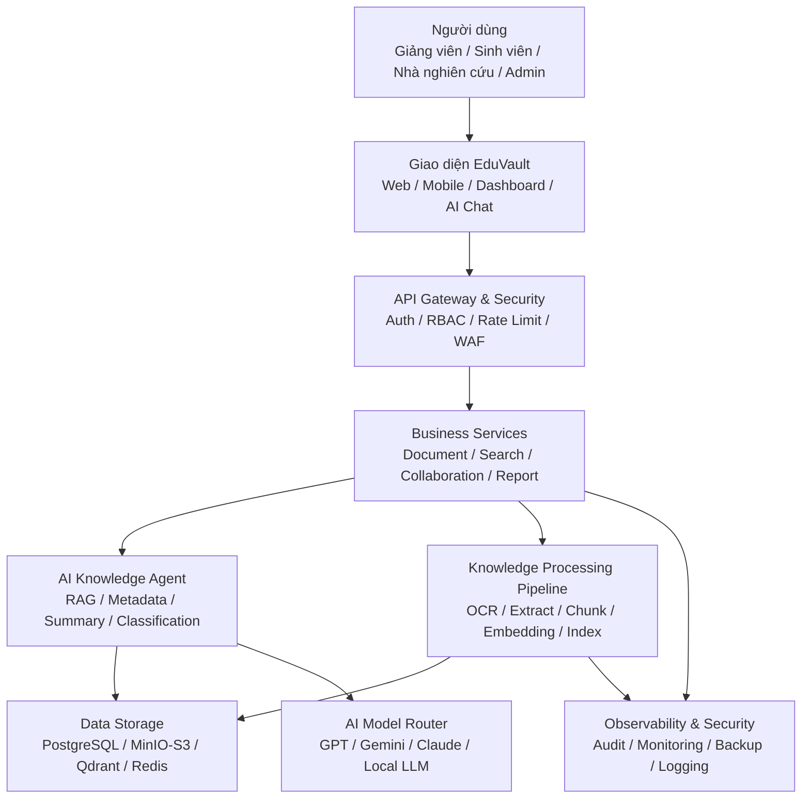

---

## 2. Các nhóm người dùng chính

| Nhóm người dùng | Vai trò chính |
|---|---|
| Giảng viên | Upload tài liệu, quản lý tri thức, hỏi đáp AI, chia sẻ tài liệu |
| Sinh viên | Tìm kiếm tài liệu được phép xem, hỏi đáp theo tài liệu học tập |
| Nhà nghiên cứu | Lưu trữ tài liệu nghiên cứu, trích xuất tri thức, cộng tác nhóm |
| Quản trị viên | Quản lý người dùng, phân quyền, cấu hình hệ thống, audit log |
| Trưởng khoa / Quản lý khoa | Theo dõi kho tri thức, duyệt tài liệu quan trọng, xem báo cáo |

---

## 3. Luồng 1 — Upload tài liệu

### 3.1 Mục tiêu

Cho phép giảng viên hoặc nhà nghiên cứu đưa tài liệu vào hệ thống một cách an toàn, có kiểm soát và có thể truy xuất lại.

### 3.2 Sơ đồ luồng

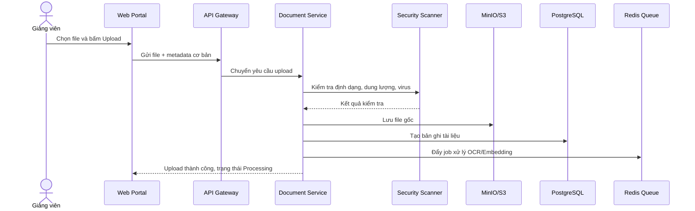

### 3.3 Đặc tả

| Thành phần | Trách nhiệm |
|---|---|
| Web Portal | Cho người dùng chọn file, nhập mô tả, chọn quyền truy cập |
| API Gateway | Kiểm tra xác thực, giới hạn dung lượng, rate limit |
| Document Service | Xử lý nghiệp vụ upload, versioning, trạng thái tài liệu |
| Security Scanner | Kiểm tra virus, định dạng nguy hiểm, file lỗi |
| MinIO/S3 | Lưu file gốc |
| PostgreSQL | Lưu metadata: tên file, người tạo, khoa, trạng thái, quyền |
| Redis Queue | Đẩy job xử lý nền |

### 3.4 Quy tắc nghiệp vụ

- Chỉ người dùng đã đăng nhập mới được upload.
- File phải thuộc định dạng cho phép: PDF, DOCX, PPTX, XLSX, TXT, PNG, JPG.
- Tài liệu mới upload có trạng thái `Processing`.
- Nếu cần kiểm duyệt, trạng thái chuyển sang `Pending Approval`.
- Nếu xử lý thành công, trạng thái chuyển sang `Published` hoặc `Draft` tùy chính sách.

---

## 4. Luồng 2 — OCR và trích xuất nội dung

### 4.1 Mục tiêu

Biến tài liệu scan, ảnh hoặc PDF thành văn bản có thể tìm kiếm và dùng cho RAG.

### 4.2 Sơ đồ luồng

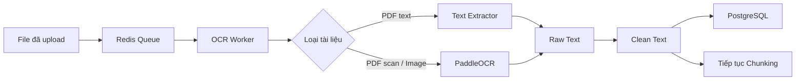

### 4.3 Đặc tả

| Input | Xử lý | Output |
|---|---|---|
| PDF thường | Extract text trực tiếp | Raw text |
| PDF scan | OCR từng trang | Raw text |
| Ảnh | OCR ảnh | Raw text |
| DOCX/PPTX | Parse nội dung | Raw text |

### 4.4 Quy tắc nghiệp vụ

- Nếu OCR thất bại, tài liệu được gắn trạng thái `OCR Failed`.
- Người dùng có thể tải lại file hoặc yêu cầu xử lý lại.
- Text sau OCR cần được lưu kèm version tài liệu.

---

## 5. Luồng 3 — AI Metadata Agent

### 5.1 Mục tiêu

Tự động sinh metadata cho tài liệu để giảm công sức nhập tay và tăng chất lượng tìm kiếm.

### 5.2 Sơ đồ luồng

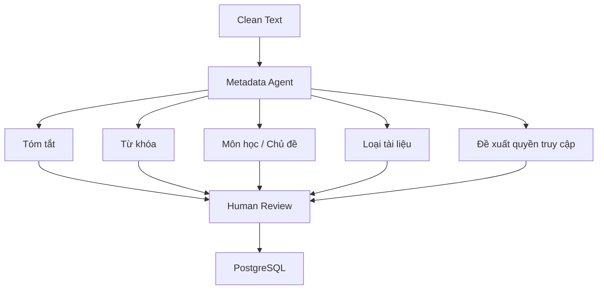

### 5.3 Metadata đề xuất

| Trường metadata | Ví dụ |
|---|---|
| Title | Nhập môn Trí tuệ nhân tạo |
| Summary | Tài liệu giới thiệu các khái niệm cơ bản về AI, ML và ứng dụng |
| Keywords | AI, Machine Learning, Neural Network |
| Subject | Trí tuệ nhân tạo |
| Document Type | Lecture Slide |
| Access Level | Internal |
| Suggested Folder | Khoa CNTT / AI / Bài giảng |

### 5.4 Quy tắc nghiệp vụ

- AI chỉ đề xuất, không nên tự động publish tài liệu quan trọng.
- Giảng viên có quyền sửa metadata trước khi duyệt.
- Với tài liệu nhạy cảm như đề thi, hệ thống phải đề xuất quyền truy cập cao hơn.

---

## 6. Luồng 4 — Chunking, Embedding và Indexing

### 6.1 Mục tiêu

Chuyển tài liệu thành các đoạn nhỏ và vector để phục vụ tìm kiếm ngữ nghĩa và hỏi đáp AI.

### 6.2 Sơ đồ luồng

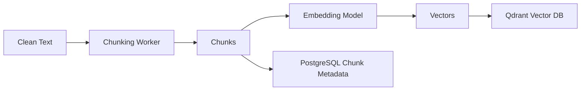

### 6.3 Đặc tả chunk

| Thuộc tính | Gợi ý |
|---|---|
| Chunk size | 500–1,000 tokens |
| Overlap | 50–150 tokens |
| Metadata | document_id, page, section, owner, access_level |
| Embedding model | BGE-M3 hoặc model embedding tương đương |
| Vector DB | Qdrant |

### 6.4 Quy tắc nghiệp vụ

- Mỗi chunk phải giữ thông tin nguồn để trích dẫn.
- Vector phải gắn quyền truy cập để tránh lộ dữ liệu khi RAG.
- Khi tài liệu bị xóa hoặc đổi quyền, index phải được cập nhật.

---

## 7. Luồng 5 — Tìm kiếm tài liệu

### 7.1 Mục tiêu

Cho phép người dùng tìm tài liệu bằng từ khóa, metadata hoặc nội dung.

### 7.2 Sơ đồ luồng

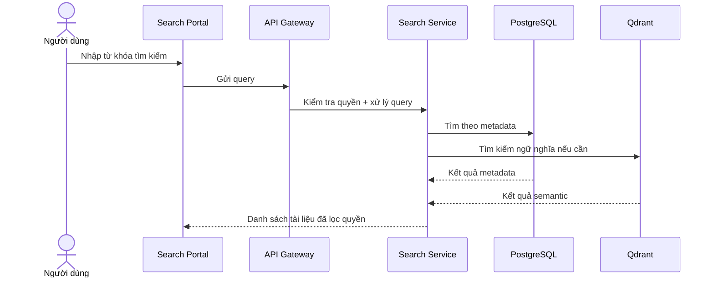

### 7.3 Loại tìm kiếm

| Loại tìm kiếm | Ví dụ |
|---|---|
| Tìm theo tên | “Machine Learning” |
| Tìm theo tác giả | “Nguyễn Văn A” |
| Tìm theo môn học | “Cơ sở dữ liệu” |
| Tìm theo tag | “RAG”, “AI Agent” |
| Tìm theo nội dung | “vector database là gì” |
| Tìm ngữ nghĩa | “tài liệu nói về học máy có giám sát” |

---

## 8. Luồng 6 — AI Chat RAG

### 8.1 Mục tiêu

Người dùng hỏi bằng ngôn ngữ tự nhiên, hệ thống truy xuất tài liệu liên quan và trả lời có trích dẫn nguồn.

### 8.2 Sơ đồ luồng

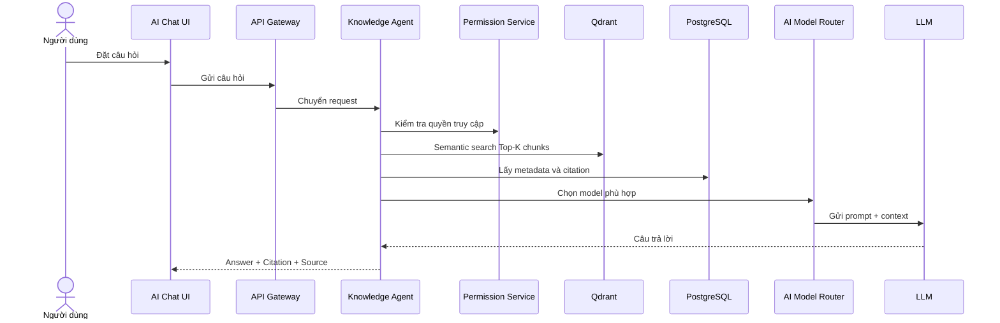

### 8.3 Đặc tả Agent

| Bước | Mô tả |
|---|---|
| Query Understanding | Hiểu ý định câu hỏi |
| Permission Filter | Lọc tài liệu theo quyền người dùng |
| Retrieval | Lấy top-k chunks từ Qdrant |
| Reranking | Sắp xếp lại kết quả liên quan nhất |
| Prompt Building | Tạo prompt có context và quy tắc trả lời |
| Generation | Gọi LLM sinh câu trả lời |
| Citation | Gắn nguồn tài liệu, trang, đoạn |
| Safety Check | Kiểm tra rò rỉ dữ liệu, hallucination, policy |

### 8.4 Quy tắc nghiệp vụ

- Không trả lời nếu không tìm thấy nguồn đáng tin cậy.
- Phải hiển thị nguồn trích dẫn.
- Không dùng tài liệu mà người dùng không có quyền xem.
- Với câu hỏi nhạy cảm, cần từ chối hoặc yêu cầu quyền cao hơn.

---

## 9. Luồng 7 — Human-in-the-loop Approval

### 9.1 Mục tiêu

Đảm bảo tài liệu và metadata do AI đề xuất được con người duyệt trước khi công bố.

### 9.2 Sơ đồ luồng

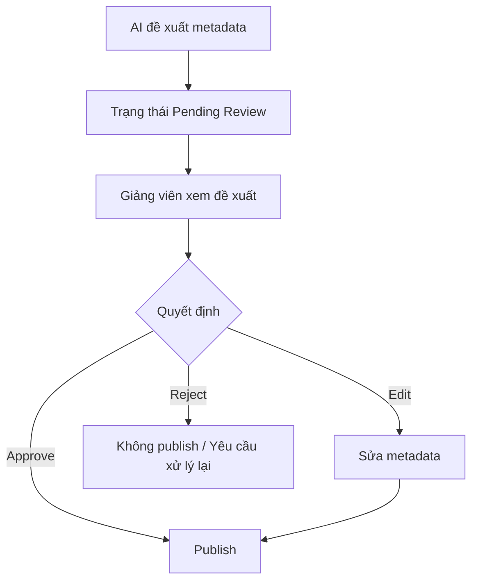

### 9.3 Đặc tả trạng thái

| Trạng thái | Ý nghĩa |
|---|---|
| Draft | Tài liệu mới tạo, chưa công bố |
| Processing | Đang OCR/embedding |
| Pending Review | Chờ người dùng duyệt |
| Published | Đã công bố theo quyền truy cập |
| Rejected | Bị từ chối |
| Archived | Lưu trữ, không hiển thị mặc định |

---

## 10. Luồng 8 — Phân quyền và bảo mật truy cập

### 10.1 Mục tiêu

Đảm bảo đúng người, đúng vai trò, đúng phạm vi mới được truy cập tài liệu.

### 10.2 Sơ đồ luồng

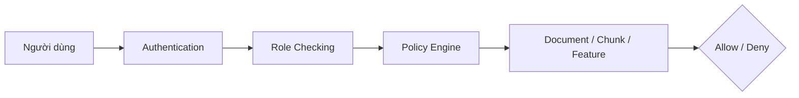

### 10.3 Mô hình quyền

| Role | Quyền chính |
|---|---|
| Student | Xem tài liệu được chia sẻ, hỏi đáp AI theo tài liệu được phép |
| Lecturer | Upload, sửa, chia sẻ, duyệt tài liệu của mình |
| Researcher | Quản lý tài liệu nhóm nghiên cứu |
| Department Admin | Quản lý tài liệu trong khoa |
| System Admin | Cấu hình toàn hệ thống |

### 10.4 Access Level

| Mức truy cập | Mô tả |
|---|---|
| Public | Ai cũng có thể xem |
| Internal | Người trong trường/khoa |
| Restricted | Chỉ nhóm hoặc role cụ thể |
| Confidential | Tài liệu nhạy cảm, cần quyền đặc biệt |

---

## 11. Luồng 9 — Multi-Tenant

### 11.1 Mục tiêu

Cho phép hệ thống phục vụ nhiều khoa, nhiều trường hoặc nhiều tổ chức mà dữ liệu không bị lẫn nhau.

### 11.2 Sơ đồ luồng

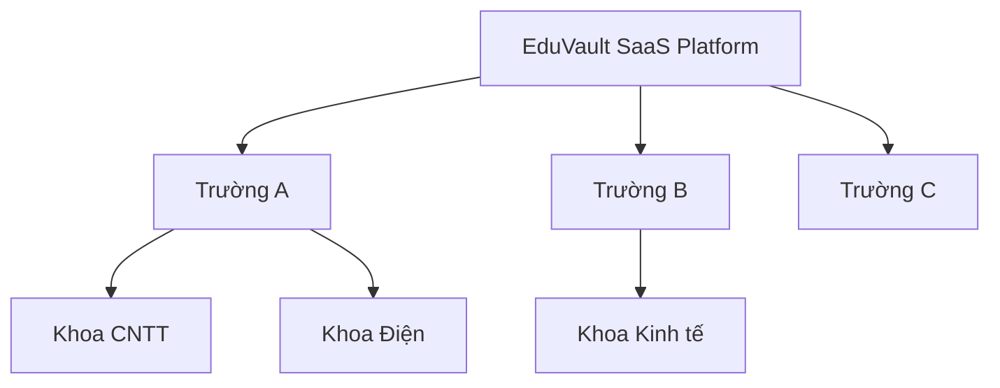

### 11.3 Quy tắc nghiệp vụ

- Người dùng thuộc tenant nào chỉ thấy dữ liệu tenant đó.
- Admin cấp trường không được xem dữ liệu trường khác.
- Có thể cấu hình branding, domain, chính sách lưu trữ theo từng tenant.
- Mỗi tenant có quota riêng về dung lượng, số người dùng và lượt gọi AI.

---

## 12. Luồng 10 — Audit Log

### 12.1 Mục tiêu

Ghi lại toàn bộ hành động quan trọng để phục vụ kiểm tra, bảo mật và tuân thủ.

### 12.2 Sơ đồ luồng

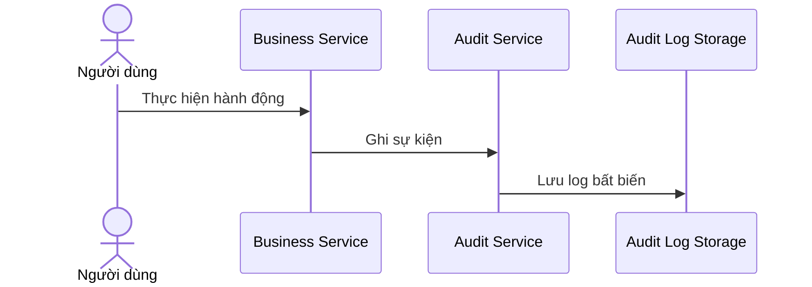

### 12.3 Sự kiện cần ghi log

| Hành động | Nội dung log |
|---|---|
| Login / Logout | user_id, thời gian, IP |
| Upload | file_id, người upload, tenant |
| Download | file_id, người tải, thời gian |
| Delete | file_id, người xóa, lý do |
| Change Permission | quyền cũ, quyền mới |
| AI Chat | query, tài liệu được dùng, model, chi phí |
| Admin Action | thao tác quản trị |

---

## 13. Luồng 11 — Backup 3-2-1 và khôi phục dữ liệu

### 13.1 Mục tiêu

Đảm bảo hệ thống có thể khôi phục khi mất dữ liệu, lỗi server hoặc sự cố cloud.

### 13.2 Sơ đồ luồng

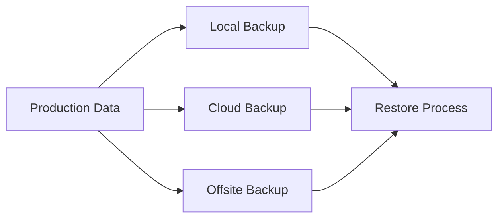

### 13.3 Quy tắc 3-2-1

| Nguyên tắc | Áp dụng |
|---|---|
| 3 bản sao | Production, local backup, cloud/offsite backup |
| 2 loại lưu trữ | Server storage và cloud storage |
| 1 bản offsite | Lưu ở cloud khác vùng hoặc nhà cung cấp khác |

### 13.4 Dữ liệu cần backup

- PostgreSQL database.
- MinIO/S3 document storage.
- Qdrant vector index.
- Cấu hình hệ thống.
- Audit log quan trọng.

---

## 14. Luồng 12 — Monitoring, Logging và Alerting

### 14.1 Mục tiêu

Theo dõi sức khỏe hệ thống, hiệu năng, lỗi và chi phí AI.

### 14.2 Sơ đồ luồng

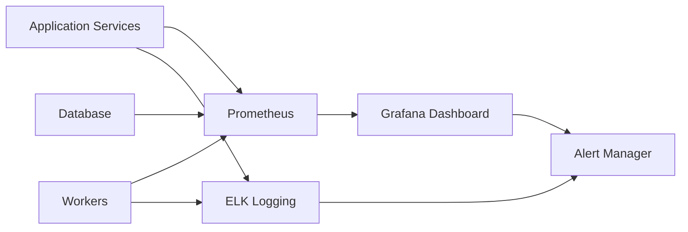

### 14.3 Chỉ số cần theo dõi

| Nhóm chỉ số | Ví dụ |
|---|---|
| API | latency, error rate, request count |
| AI | token usage, model cost, hallucination rate |
| Search | retrieval latency, top-k relevance |
| Worker | queue length, failed jobs, processing time |
| Storage | disk usage, object count, backup status |
| Security | failed login, abnormal download, permission denied |

---

## 15. Luồng 13 — AI Model Router và kiểm soát chi phí

### 15.1 Mục tiêu

Tự động chọn model phù hợp theo độ khó, chi phí và yêu cầu bảo mật.

### 15.2 Sơ đồ luồng

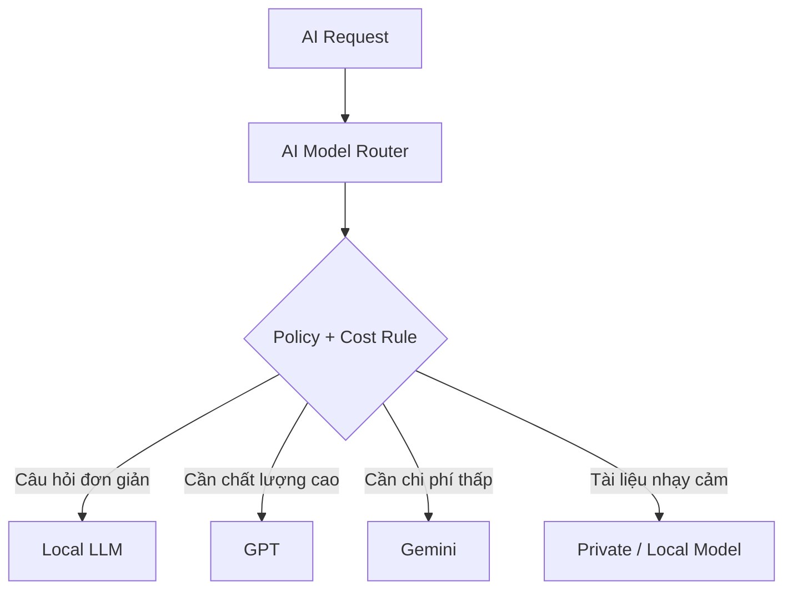

### 15.3 Quy tắc định tuyến

| Tình huống | Model gợi ý |
|---|---|
| Tóm tắt đơn giản | Local LLM hoặc Gemini Flash |
| Hỏi đáp cần độ chính xác cao | GPT hoặc Claude |
| Tài liệu nhạy cảm | Local LLM / Private deployment |
| Batch metadata số lượng lớn | Model rẻ, chạy nền |
| Câu hỏi dài, nhiều reasoning | Model mạnh hơn |

---

## 16. Luồng 14 — Collaboration và chia sẻ tài liệu

### 16.1 Mục tiêu

Cho phép giảng viên và nhóm nghiên cứu chia sẻ tài liệu, bình luận và làm việc chung.

### 16.2 Sơ đồ luồng

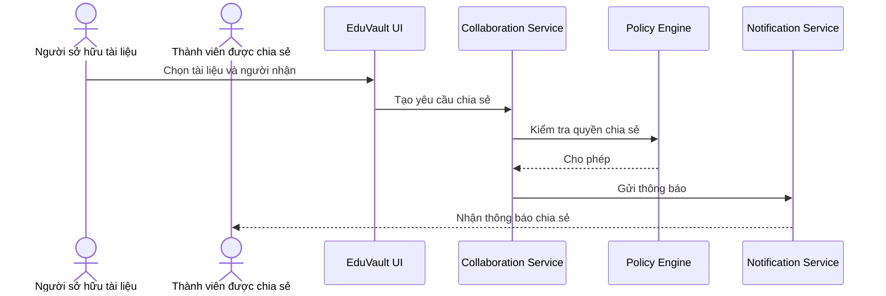

### 16.3 Quy tắc nghiệp vụ

- Người sở hữu tài liệu có thể chia sẻ theo người, nhóm hoặc khoa.
- Không được chia sẻ vượt quá chính sách tenant.
- Tài liệu confidential cần xác nhận hoặc phê duyệt bổ sung.

---

## 17. Luồng 15 — Analytics và báo cáo

### 17.1 Mục tiêu

Giúp nhà quản lý hiểu mức độ sử dụng kho tri thức và hiệu quả khai thác AI.

### 17.2 Sơ đồ luồng

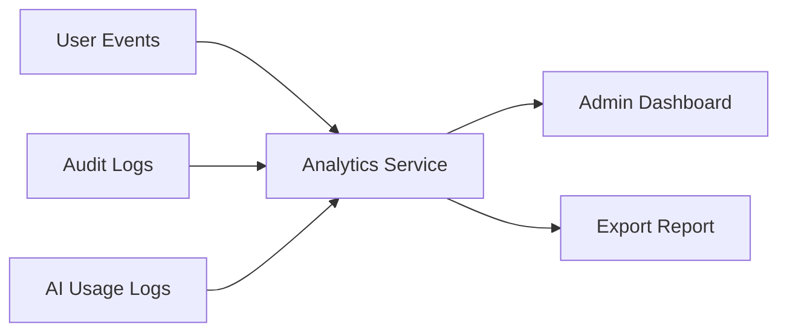

### 17.3 Báo cáo gợi ý

| Báo cáo | Ý nghĩa |
|---|---|
| Số tài liệu theo khoa | Đo mức độ đóng góp tri thức |
| Tài liệu được xem nhiều | Xác định tài liệu có giá trị |
| Câu hỏi AI phổ biến | Hiểu nhu cầu người học/người dạy |
| Chi phí AI theo tenant | Kiểm soát ngân sách |
| Người dùng hoạt động | Đánh giá adoption |
| Lỗi xử lý tài liệu | Cải thiện pipeline |

---

## 18. Công nghệ đề xuất

| Thành phần | Công nghệ đề xuất |
|---|---|
| Frontend | Next.js |
| Backend API | FastAPI |
| Database | PostgreSQL |
| Object Storage | MinIO hoặc AWS S3 |
| Vector Database | Qdrant |
| Cache / Queue | Redis |
| Worker | Celery hoặc RQ |
| OCR | PaddleOCR |
| AI Agent | LangGraph |
| Embedding | BGE-M3 |
| Reranker | BGE-Reranker |
| Auth | OAuth2, SSO, LDAP |
| Monitoring | Prometheus + Grafana |
| Logging | ELK Stack |
| Deployment MVP | Docker Compose |
| Deployment Scale | Kubernetes |
| CI/CD | GitHub Actions |

---

## 19. Kiến trúc MVP đề xuất

Nếu triển khai cho một khoa trong giai đoạn đầu, nên tinh gọn như sau:

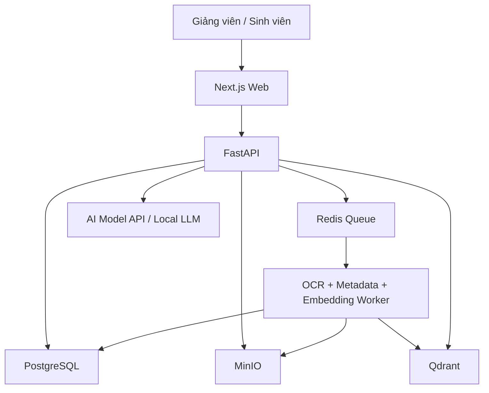

### MVP nên có

- Đăng nhập và phân quyền cơ bản.
- Upload tài liệu.
- OCR và trích xuất text.
- Tự động sinh metadata.
- Tìm kiếm tài liệu.
- AI Chat RAG có trích dẫn.
- Quản lý quyền truy cập.
- Audit log cơ bản.
- Backup định kỳ.

### MVP chưa cần vội

- Kubernetes.
- Graph Database.
- Quá nhiều Agent riêng biệt.
- Multi-cloud phức tạp.
- Workflow approval nhiều tầng.
- Recommendation nâng cao.

---

## 20. Roadmap triển khai

| Giai đoạn | Mục tiêu | Thành phần chính |
|---|---|---|
| Phase 1 — MVP | Chạy được cho một khoa | Upload, Search, RAG, RBAC cơ bản |
| Phase 2 — Pilot | Dùng thật với giảng viên | OCR tốt hơn, metadata AI, dashboard |
| Phase 3 — Department Scale | Mở rộng trong khoa | Approval, audit, analytics, backup chuẩn |
| Phase 4 — University Scale | Nhiều khoa | Multi-tenant, SSO, policy engine |
| Phase 5 — Enterprise | Bán cho nhiều trường | Kubernetes, cost control, advanced governance |

---

## 21. Kết luận CTO

Bản thiết kế 10/10 cho EduVault không phải là bản có nhiều thành phần nhất, mà là bản có khả năng:

1. Giải quyết đúng nỗi đau của giảng viên: lưu trữ, tìm kiếm, hỏi đáp và chia sẻ tri thức.
2. Triển khai được trong 3–6 tháng cho một khoa.
3. Mở rộng được lên nhiều khoa và nhiều trường.
4. Có AI nhưng không lạm dụng AI.
5. Có bảo mật, phân quyền, audit và backup ngay từ đầu.
6. Có khả năng kiểm soát chi phí AI khi scale.

Kiến trúc phù hợp nhất là bắt đầu bằng MVP gọn, sau đó mở rộng dần thành Enterprise Architecture theo roadmap.
