# EDUVAULT AI - KIẾN TRÚC V2

## Kiến trúc hệ thống kho tri thức AI cho một khoa

**Mục tiêu:** xây dựng nền tảng lưu trữ, quản lý, tìm kiếm, chuyển giao và khai thác tri thức bằng AI cho một khoa.

**Phiên bản:** V2  
**Phạm vi triển khai:** một khoa, giữ nguyên actor và toàn bộ chức năng của MVP hiện tại.  
**Quy mô MVP:** tối đa khoảng 100 GB dữ liệu.  
**Mô hình triển khai:** hybrid, ứng dụng và dữ liệu chính do khoa quản lý, có thể sử dụng AI API và bản sao lưu ngoài hệ thống.

### 0.1 Các quyết định kiến trúc đã chốt

| Chủ đề | Quyết định V2 |
|---|---|
| Phạm vi tổ chức | Một khoa, chưa triển khai multi-tenant hoặc SaaS nhiều trường |
| Actor | Giảng viên, Giảng viên mới, Trưởng bộ môn/Trưởng khoa, Quản trị viên |
| Database | MySQL 8.4 là system of record cho metadata, quyền, phiên bản, audit và trạng thái xử lý |
| File gốc | Lưu trên MinIO; MySQL chỉ lưu object key, URI, checksum, kích thước và metadata |
| Vector | Qdrant lưu embedding; MySQL giữ chunk metadata, model và vector store key |
| Queue | Redis + Celery/RQ; phát job qua transactional outbox |
| AI | Cho phép gửi nội dung tới AI API theo policy; tài liệu nhạy cảm phải dùng model/provider được phê duyệt |
| Backup | Tuân thủ 3-2-1; `RPO < 1 giờ`, `RTO < 4 giờ` |
| Khả dụng | MVP hybrid cho một khoa, ưu tiên dễ vận hành và phục hồi hơn mở rộng đa tenant |

### 0.2 Ranh giới dữ liệu

- MySQL 8.4 không lưu file nhị phân gốc.
- MinIO lưu file gốc, các phiên bản bất biến và bản text đã trích xuất khi cần.
- Qdrant chỉ lưu vector và payload tối thiểu phục vụ lọc quyền; MySQL giữ lineage và nguồn sự thật.
- Public trong V2 nghĩa là mọi người dùng đã đăng nhập thuộc khoa đều có thể xem, không phải công khai ẩn danh trên Internet.
- Tài liệu cá nhân mặc định chỉ chủ sở hữu được xem, trừ khi chủ sở hữu chuyển sang Public hoặc cấp quyền rõ ràng.
- Đề thi toàn khoa chỉ Trưởng bộ môn/Trưởng khoa và người được cấp quyền mới được xem trước ngày công bố. Sau ngày thi, hệ thống có thể chuyển sang Public theo lịch đã cấu hình và phải ghi audit.

---

## 1. Tổng quan kiến trúc

EduVault AI V2 được thiết kế theo kiến trúc nhiều tầng, cân bằng giữa khả năng triển khai thực tế, bảo mật, phục hồi và ứng dụng AI.

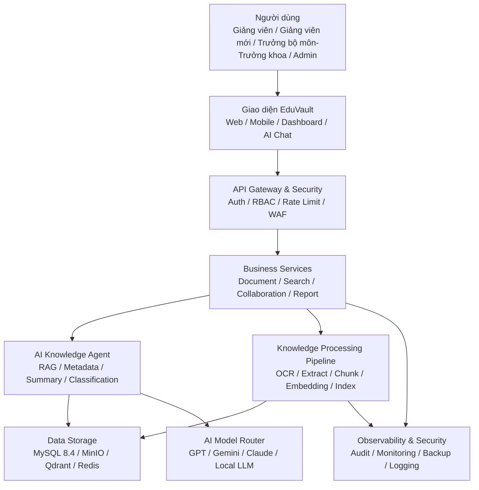

---

## 2. Các nhóm người dùng chính

| Nhóm người dùng | Vai trò chính |
|---|---|
| Giảng viên | Upload tài liệu, quản lý tài liệu cá nhân, hỏi đáp AI, chia sẻ và duyệt yêu cầu truy cập |
| Giảng viên mới | Tiếp nhận học phần/quy trình, đọc nội dung được bàn giao, hỏi đáp tài liệu được phép |
| Trưởng bộ môn / Trưởng khoa | Quản lý phân quyền trong khoa, chuyển giao tri thức, xem đề thi toàn khoa, giám sát chất lượng và báo cáo |
| Quản trị viên | Quản lý người dùng, policy, backup, kho lưu trữ ngoài, audit và vận hành hệ thống |

---

## 3. Luồng 1 — Upload tài liệu

### 3.1 Mục tiêu

Cho phép giảng viên đưa tài liệu vào hệ thống một cách an toàn, có kiểm soát và có thể truy xuất lại.

### 3.2 Sơ đồ luồng

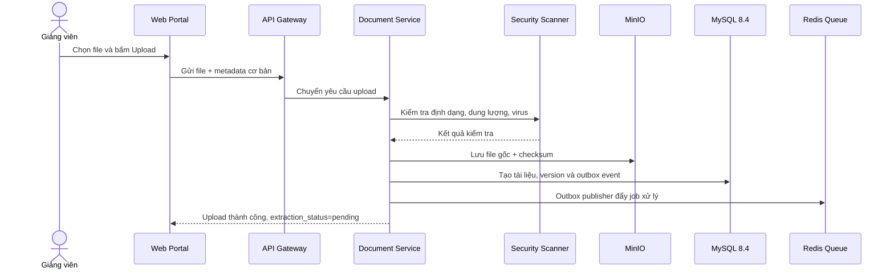

### 3.3 Đặc tả

| Thành phần | Trách nhiệm |
|---|---|
| Web Portal | Cho người dùng chọn file, nhập mô tả, chọn quyền truy cập |
| API Gateway | Kiểm tra xác thực, giới hạn dung lượng, rate limit |
| Document Service | Xử lý nghiệp vụ upload, versioning, trạng thái tài liệu |
| Security Scanner | Kiểm tra virus, định dạng nguy hiểm, file lỗi |
| MinIO | Lưu file gốc và từng version bất biến |
| MySQL 8.4 | Lưu metadata, object key MinIO, checksum, version, trạng thái và quyền |
| Redis Queue | Đẩy job xử lý nền |

### 3.4 Quy tắc nghiệp vụ

- Chỉ người dùng đã đăng nhập mới được upload.
- File phải thuộc định dạng cho phép: PDF, DOCX, PPTX, XLSX, TXT, PNG, JPG.
- Tài liệu mới có `lifecycle_status = draft`, các trạng thái xử lý là `pending`.
- Trong quá trình xử lý, worker cập nhật riêng `scan_status`, `extraction_status`
  và `indexing_status`.
- Nếu cần kiểm duyệt, `lifecycle_status` chuyển sang `review`.
- Nếu được duyệt, `lifecycle_status` chuyển sang `published`; nếu chưa công bố vẫn là `draft`.
- Upload, tạo version và tạo outbox event phải nằm trong một transaction nghiệp vụ.
- Worker phải idempotent, có retry giới hạn và dead-letter queue cho job thất bại.
- Nếu file đã lưu trên MinIO nhưng transaction DB thất bại, consistency worker phải phát hiện và xử lý object mồ côi.

---

## 4. Luồng 2 — OCR và trích xuất nội dung

### 4.1 Mục tiêu

Biến tài liệu scan, ảnh hoặc PDF thành văn bản có thể tìm kiếm và dùng cho RAG.

### 4.2 Sơ đồ luồng

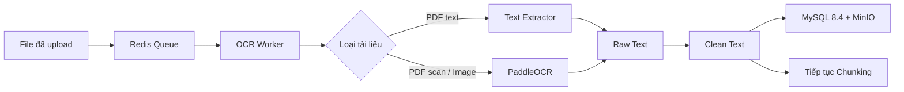

### 4.3 Đặc tả

| Input | Xử lý | Output |
|---|---|---|
| PDF thường | Extract text trực tiếp | Raw text |
| PDF scan | OCR từng trang | Raw text |
| Ảnh | OCR ảnh | Raw text |
| DOCX/PPTX | Parse nội dung | Raw text |

### 4.4 Quy tắc nghiệp vụ

- Nếu OCR thất bại, tài liệu được gắn trạng thái `OCR Failed`.
- Người dùng có thể tải lại file hoặc yêu cầu xử lý lại.
- Text sau OCR cần được lưu kèm version tài liệu.

---

## 5. Luồng 3 — AI Metadata Agent

### 5.1 Mục tiêu

Tự động sinh metadata cho tài liệu để giảm công sức nhập tay và tăng chất lượng tìm kiếm.

### 5.2 Sơ đồ luồng

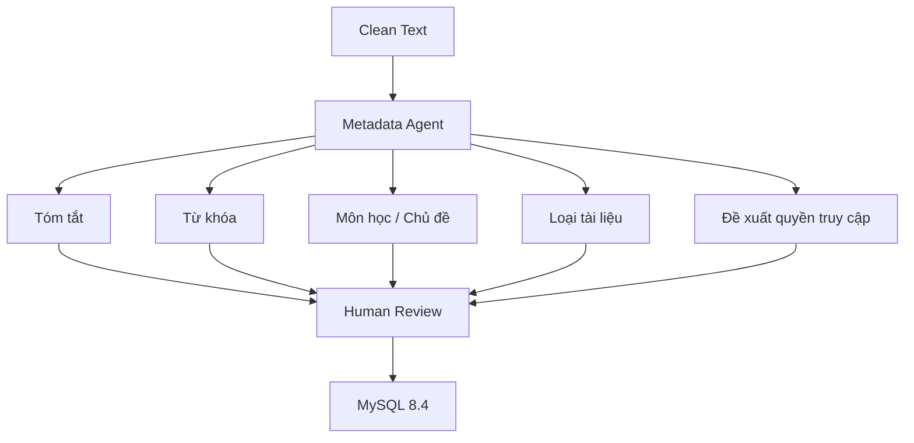

### 5.3 Metadata đề xuất

| Trường metadata | Ví dụ |
|---|---|
| Title | Nhập môn Trí tuệ nhân tạo |
| Summary | Tài liệu giới thiệu các khái niệm cơ bản về AI, ML và ứng dụng |
| Keywords | AI, Machine Learning, Neural Network |
| Subject | Trí tuệ nhân tạo |
| Document Type | Lecture Slide |
| Access Level | Private |
| Suggested Folder | Khoa CNTT / AI / Bài giảng |

### 5.4 Quy tắc nghiệp vụ

- AI chỉ đề xuất, không nên tự động publish tài liệu quan trọng.
- Giảng viên có quyền sửa metadata trước khi duyệt.
- Với tài liệu nhạy cảm như đề thi, hệ thống phải đề xuất quyền truy cập cao hơn.

---

## 6. Luồng 4 — Chunking, Embedding và Indexing

### 6.1 Mục tiêu

Chuyển tài liệu thành các đoạn nhỏ và vector để phục vụ tìm kiếm ngữ nghĩa và hỏi đáp AI.

### 6.2 Sơ đồ luồng

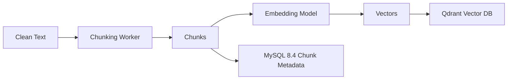

### 6.3 Đặc tả chunk

| Thuộc tính | Gợi ý |
|---|---|
| Chunk size | 500–1,000 tokens |
| Overlap | 50–150 tokens |
| Metadata | document_id, page, section, owner, access_level |
| Embedding model | BGE-M3 hoặc model embedding tương đương |
| Vector DB | Qdrant |

### 6.4 Quy tắc nghiệp vụ

- Mỗi chunk phải giữ thông tin nguồn để trích dẫn.
- Vector phải gắn quyền truy cập để tránh lộ dữ liệu khi RAG.
- Khi tài liệu bị xóa hoặc đổi quyền, index phải được cập nhật.

---

## 7. Luồng 5 — Tìm kiếm tài liệu

### 7.1 Mục tiêu

Cho phép người dùng tìm tài liệu bằng từ khóa, metadata hoặc nội dung.

### 7.2 Sơ đồ luồng

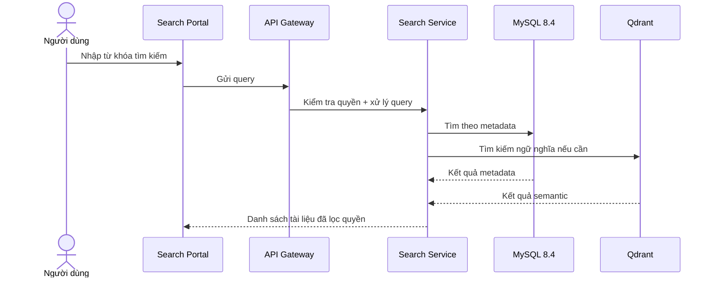

### 7.3 Loại tìm kiếm

| Loại tìm kiếm | Ví dụ |
|---|---|
| Tìm theo tên | “Machine Learning” |
| Tìm theo tác giả | “Nguyễn Văn A” |
| Tìm theo môn học | “Cơ sở dữ liệu” |
| Tìm theo tag | “RAG”, “AI Agent” |
| Tìm theo nội dung | “vector database là gì” |
| Tìm ngữ nghĩa | “tài liệu nói về học máy có giám sát” |

---

## 8. Luồng 6 — AI Chat RAG

### 8.1 Mục tiêu

Người dùng hỏi bằng ngôn ngữ tự nhiên, hệ thống truy xuất tài liệu liên quan và trả lời có trích dẫn nguồn.

### 8.2 Sơ đồ luồng

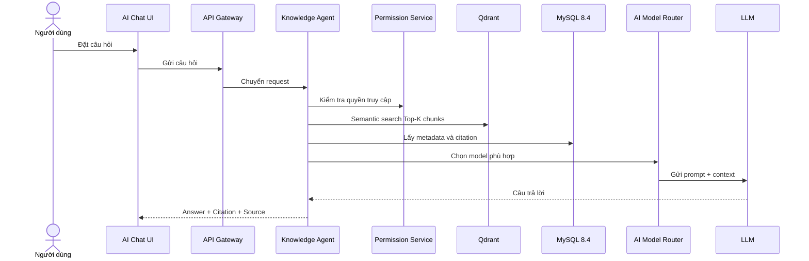

### 8.3 Đặc tả Agent

| Bước | Mô tả |
|---|---|
| Query Understanding | Hiểu ý định câu hỏi |
| Permission Filter | Lọc tài liệu theo quyền người dùng |
| Retrieval | Lấy top-k chunks từ Qdrant |
| Reranking | Sắp xếp lại kết quả liên quan nhất |
| Prompt Building | Tạo prompt có context và quy tắc trả lời |
| Generation | Gọi LLM sinh câu trả lời |
| Citation | Gắn nguồn tài liệu, trang, đoạn |
| Safety Check | Kiểm tra rò rỉ dữ liệu, hallucination, policy |

### 8.4 Quy tắc nghiệp vụ

- Không trả lời nếu không tìm thấy nguồn đáng tin cậy.
- Phải hiển thị nguồn trích dẫn.
- Không dùng tài liệu mà người dùng không có quyền xem.
- Với câu hỏi nhạy cảm, cần từ chối hoặc yêu cầu quyền cao hơn.

---

## 9. Luồng 7 — Human-in-the-loop Approval

### 9.1 Mục tiêu

Đảm bảo tài liệu và metadata do AI đề xuất được con người duyệt trước khi công bố.

### 9.2 Sơ đồ luồng

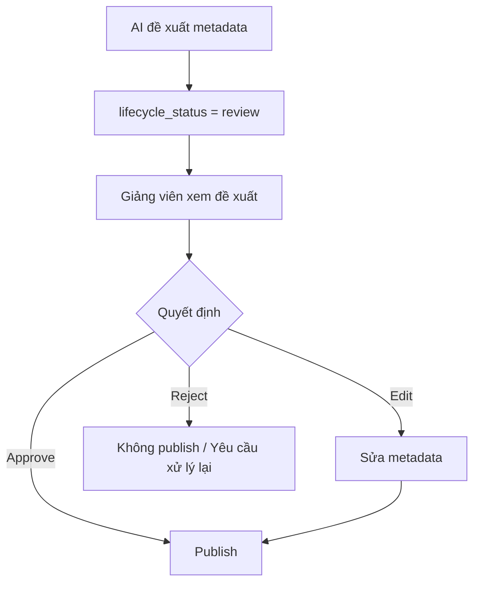

### 9.3 Mô hình trạng thái V2

Không dùng một cột trạng thái duy nhất cho cả nghiệp vụ và xử lý kỹ thuật.

| Nhóm trạng thái | Giá trị |
|---|---|
| `lifecycle_status` | `draft`, `review`, `published`, `archived`, `rejected` |
| `scan_status` | `pending`, `clean`, `infected`, `failed` |
| `extraction_status` | `pending`, `processing`, `completed`, `failed` |
| `indexing_status` | `pending`, `processing`, `completed`, `failed` |
| `sync_status` | `pending`, `processing`, `completed`, `failed` |

Tài liệu chỉ được truy xuất trong RAG khi `lifecycle_status = published`,
`scan_status = clean` và `indexing_status = completed`.

---

## 10. Luồng 8 — Phân quyền và bảo mật truy cập

### 10.1 Mục tiêu

Đảm bảo đúng người, đúng vai trò, đúng phạm vi mới được truy cập tài liệu.

### 10.2 Sơ đồ luồng

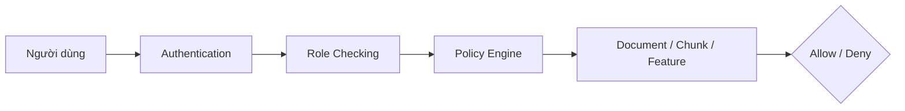

### 10.3 Mô hình quyền

| Role | Quyền chính |
|---|---|
| Giảng viên | Upload, sửa, chia sẻ, duyệt tài liệu của mình và phê duyệt yêu cầu truy cập |
| Giảng viên mới | Xem tài liệu được bàn giao/chia sẻ và hỏi đáp AI trong phạm vi được phép |
| Trưởng bộ môn / Trưởng khoa | Quản lý quyền trong khoa, đề thi toàn khoa, chuyển giao và báo cáo |
| Quản trị viên | Quản lý người dùng, policy, backup, audit và cấu hình hệ thống |

### 10.4 Access Level

| Mức truy cập | Mô tả |
|---|---|
| Public | Mọi người dùng đã đăng nhập thuộc khoa có thể xem |
| Private | Chỉ chủ sở hữu hoặc người được chủ sở hữu cấp quyền có thể xem |
| Restricted | Chỉ nhóm, actor hoặc danh sách ACL cụ thể có thể xem |
| Confidential | Tài liệu nhạy cảm; policy bắt buộc thắng mọi ACL thông thường |

---

## 11. Luồng 9 — Phạm vi một khoa và chính sách đề thi

### 11.1 Mục tiêu

Giữ hệ thống đơn giản cho một khoa nhưng bảo đảm tài liệu cá nhân và đề thi được
kiểm soát đúng actor, đúng thời điểm.

### 11.2 Sơ đồ luồng

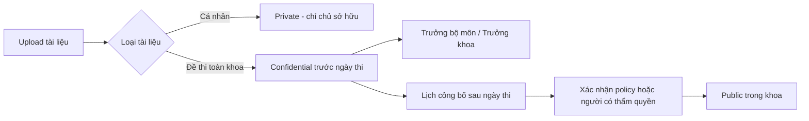

### 11.3 Quy tắc nghiệp vụ

- V2 không có tenant và không chia sẻ dữ liệu sang khoa/trường khác.
- Tài liệu cá nhân mặc định là `Private`; admin không mặc nhiên được đọc nội dung.
- Đề thi toàn khoa được phân loại `Confidential` trước ngày thi.
- Trước ngày thi, chỉ Trưởng bộ môn/Trưởng khoa và ACL được phê duyệt có quyền đọc.
- Sau ngày thi, scheduler tạo yêu cầu chuyển Public theo policy; thao tác phải có
  audit, thời điểm hiệu lực và người/policy chịu trách nhiệm.
- Nếu kỳ thi bị hoãn hoặc policy thay đổi, người có thẩm quyền có thể hủy lịch
  công bố trước thời điểm hiệu lực.

---

## 12. Luồng 10 — Audit Log

### 12.1 Mục tiêu

Ghi lại toàn bộ hành động quan trọng để phục vụ kiểm tra, bảo mật và tuân thủ.

### 12.2 Sơ đồ luồng

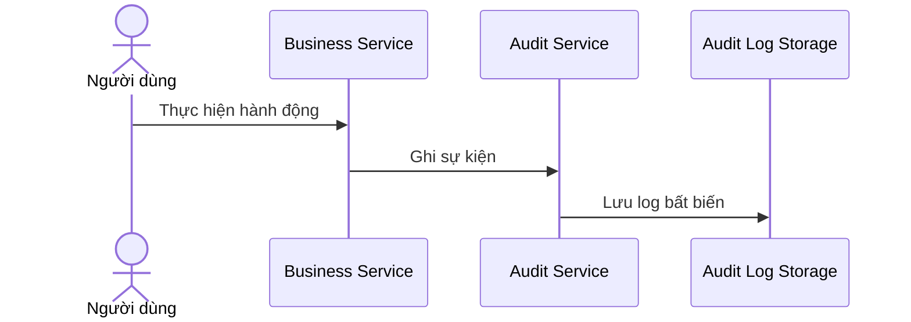

### 12.3 Sự kiện cần ghi log

| Hành động | Nội dung log |
|---|---|
| Login / Logout | user_id, thời gian, IP |
| Upload | file_id, người upload, phạm vi khoa |
| Download | file_id, người tải, thời gian |
| Delete | file_id, người xóa, lý do |
| Change Permission | quyền cũ, quyền mới |
| AI Chat | query, tài liệu được dùng, model, chi phí |
| Admin Action | thao tác quản trị |

---

## 13. Luồng 11 — Backup 3-2-1 và khôi phục dữ liệu

### 13.1 Mục tiêu

Đảm bảo hệ thống có thể khôi phục khi mất dữ liệu, lỗi server hoặc sự cố cloud.

### 13.2 Sơ đồ luồng

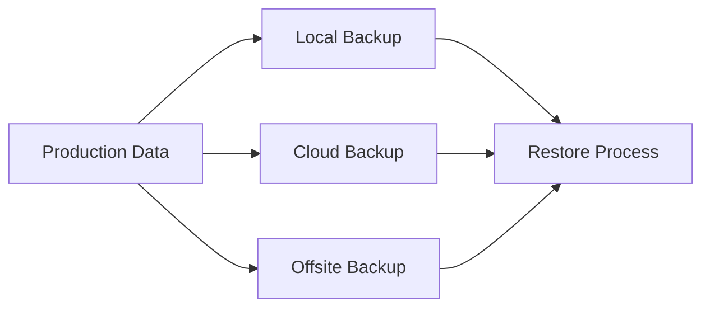

### 13.3 Quy tắc 3-2-1

| Nguyên tắc | Áp dụng |
|---|---|
| 3 bản sao | Production, local backup, cloud/offsite backup |
| 2 loại lưu trữ | Server storage và cloud storage |
| 1 bản offsite | Lưu ở cloud khác vùng hoặc nhà cung cấp khác |

### 13.4 Dữ liệu cần backup

- MySQL 8.4 database và binlog phục vụ point-in-time recovery.
- MinIO document storage, versioning và object metadata.
- Qdrant snapshot hoặc khả năng rebuild index từ MySQL + MinIO.
- Cấu hình hệ thống.
- Audit log quan trọng.

### 13.5 Mục tiêu phục hồi V2

| Chỉ tiêu | Mục tiêu |
|---|---|
| RPO | Nhỏ hơn 1 giờ |
| RTO | Nhỏ hơn 4 giờ |
| Kiểm thử restore | Tối thiểu hàng quý và sau thay đổi lớn |
| Bản sao | Ít nhất 3 bản, 2 loại media, 1 bản offsite |
| Kiểm tra | Checksum, restore test và báo cáo compliance |

Qdrant không bắt buộc là nguồn backup duy nhất vì vector có thể tái tạo. Tuy
nhiên cần snapshot Qdrant để đạt RTO dưới 4 giờ khi dữ liệu tăng.

---

## 14. Luồng 12 — Monitoring, Logging và Alerting

### 14.1 Mục tiêu

Theo dõi sức khỏe hệ thống, hiệu năng, lỗi và chi phí AI.

### 14.2 Sơ đồ luồng

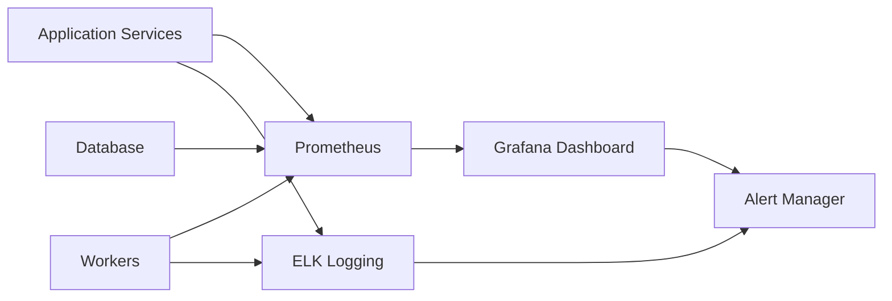

### 14.3 Chỉ số cần theo dõi

| Nhóm chỉ số | Ví dụ |
|---|---|
| API | latency, error rate, request count |
| AI | token usage, model cost, hallucination rate |
| Search | retrieval latency, top-k relevance |
| Worker | queue length, failed jobs, processing time |
| Storage | disk usage, object count, backup status |
| Security | failed login, abnormal download, permission denied |

---

## 15. Luồng 13 — AI Model Router và kiểm soát chi phí

### 15.1 Mục tiêu

Tự động chọn model phù hợp theo độ khó, chi phí và yêu cầu bảo mật.

### 15.2 Sơ đồ luồng

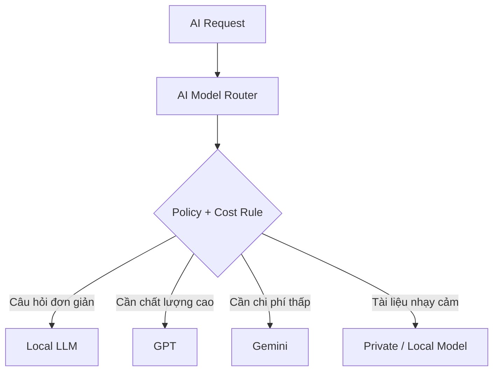

### 15.3 Quy tắc định tuyến

| Tình huống | Model gợi ý |
|---|---|
| Tóm tắt đơn giản | Local LLM hoặc Gemini Flash |
| Hỏi đáp cần độ chính xác cao | GPT hoặc Claude |
| Tài liệu nhạy cảm | Local LLM / Private deployment |
| Batch metadata số lượng lớn | Model rẻ, chạy nền |
| Câu hỏi dài, nhiều reasoning | Model mạnh hơn |

---

## 16. Luồng 14 — Collaboration và chia sẻ tài liệu

### 16.1 Mục tiêu

Cho phép giảng viên và các nhóm làm việc trong khoa chia sẻ tài liệu, bình luận và làm việc chung.

### 16.2 Sơ đồ luồng

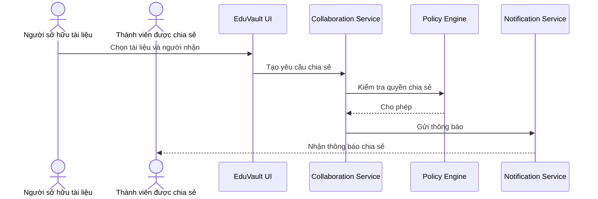

### 16.3 Quy tắc nghiệp vụ

- Người sở hữu tài liệu có thể chia sẻ theo người, nhóm hoặc khoa.
- Không được chia sẻ vượt quá chính sách của khoa.
- Tài liệu confidential cần xác nhận hoặc phê duyệt bổ sung.

---

## 17. Luồng 15 — Analytics và báo cáo

### 17.1 Mục tiêu

Giúp nhà quản lý hiểu mức độ sử dụng kho tri thức và hiệu quả khai thác AI.

### 17.2 Sơ đồ luồng

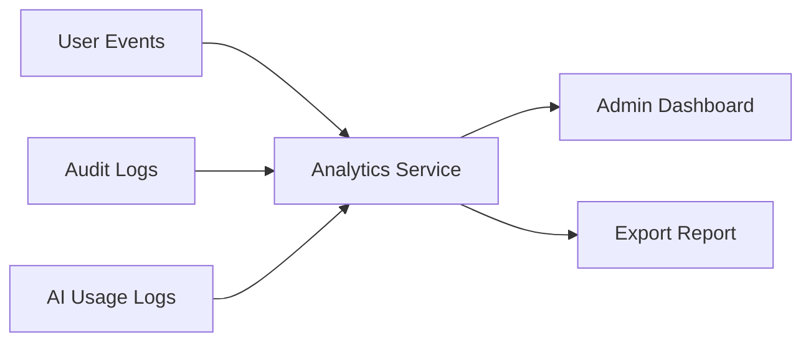

### 17.3 Báo cáo gợi ý

| Báo cáo | Ý nghĩa |
|---|---|
| Số tài liệu theo khoa | Đo mức độ đóng góp tri thức |
| Tài liệu được xem nhiều | Xác định tài liệu có giá trị |
| Câu hỏi AI phổ biến | Hiểu nhu cầu người học/người dạy |
| Chi phí AI theo actor/model/thời gian | Kiểm soát ngân sách |
| Người dùng hoạt động | Đánh giá adoption |
| Lỗi xử lý tài liệu | Cải thiện pipeline |

---

## 18. Các luồng bắt buộc để giữ toàn bộ chức năng bản cũ

### 18.1 Versioning, rollback, thùng rác và purge

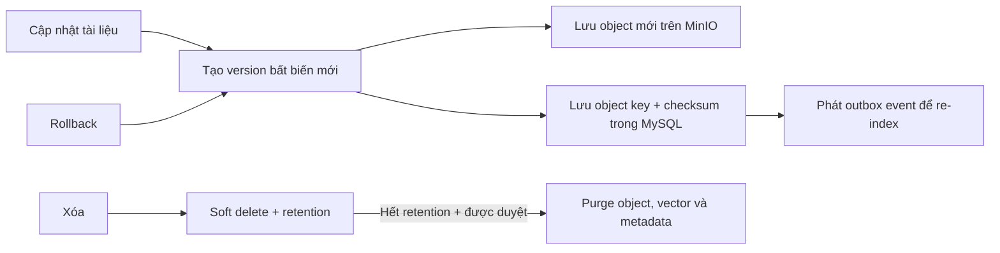

- Không ghi đè version cũ; rollback tạo version mới trỏ về version nguồn.
- Citation phải gắn với `document_version_id`.
- Khi soft delete, tài liệu bị loại khỏi search/RAG ngay nhưng file chỉ bị purge
  sau retention và kiểm tra legal hold.
- Purge phải xóa hoặc đánh dấu xóa đồng bộ trong MySQL, MinIO và Qdrant.

### 18.2 Xin quyền, phê duyệt và thu hồi quyền

- Tài liệu Private của người khác chỉ hiển thị thông tin tối thiểu để gửi yêu cầu.
- Yêu cầu được chủ sở hữu phê duyệt hoặc từ chối; quyền đã duyệt có thể có ngày hết hạn.
- Quyền đã duyệt phải tạo ACL thực tế; bản ghi yêu cầu chỉ là lịch sử workflow.
- Khi thu hồi hoặc thay đổi quyền, cache và Qdrant payload phải được cập nhật,
  đồng thời mọi lần truy cập sau đó phải bị chặn ngay tại authorization service.

### 18.3 Tiếp nhận học phần, quy trình và chuyển giao tri thức

- Trưởng bộ môn/Trưởng khoa khởi tạo gói chuyển giao giữa giảng viên bàn giao và
  giảng viên mới.
- Gói chuyển giao chứa danh sách tài liệu, checklist, hạn hoàn thành và tiến độ.
- AI có thể tổng hợp học phần/quy trình nhưng không tự cấp quyền cho người nhận.
- Trạng thái và thay đổi tài liệu trong gói chuyển giao phải được audit.

### 18.4 Quản lý policy, người dùng và kho ngoài

- Admin quản lý người dùng, khóa tài khoản và gán actor theo phạm vi một khoa.
- Policy bao gồm lưu trữ, đặt tên, quyền, đề thi, retention, backup và AI provider.
- Google Drive/OneDrive/SharePoint hoặc S3 ngoài hệ thống có thể dùng làm bản sao
  offsite; MinIO vẫn là nơi lưu file gốc chính của V2.
- Đồng bộ ngoài chạy bằng background job, có retry, checksum và trạng thái chi tiết.

### 18.5 Giám sát chất lượng và báo cáo

- Giữ các báo cáo tài liệu lỗi thời, tài liệu trùng lặp, học phần thiếu tài liệu,
  hoạt động người dùng, lượt hỏi đáp AI và trạng thái backup.
- Báo cáo không được làm lộ nội dung hoặc tên tài liệu Private cho người không có quyền.

### 18.6 Ma trận giữ chức năng phiên bản cũ

| Nhóm chức năng cũ | Cam kết trong V2 |
|---|---|
| Đăng nhập, xác thực, quản lý người dùng | Giữ nguyên và chuẩn bị tích hợp SSO |
| Upload, AI metadata, folder policy | Giữ nguyên; file gốc chuyển sang MinIO |
| Tìm kiếm, provenance, hỏi đáp có citation | Giữ nguyên; vector chuyển sang Qdrant |
| Version history, rollback, trash, restore | Giữ nguyên; version bất biến trên MinIO |
| Public/Private, xin quyền, phê duyệt, thu hồi | Giữ nguyên và mở rộng ACL có hạn dùng |
| Tiếp nhận học phần và quy trình | Giữ nguyên |
| Chuyển giao tri thức và theo dõi tiến độ | Giữ nguyên |
| Giám sát chất lượng và báo cáo sử dụng | Giữ nguyên |
| Policy lưu trữ, quyền, AI và backup | Giữ nguyên |
| Backup, restore, kho ngoài và kiểm tra 3-2-1 | Giữ nguyên; nâng cấp để đạt RPO/RTO V2 |
| Audit log | Giữ nguyên; nâng cấp theo hướng append-only và chống sửa đổi |

---

## 19. Mô hình dữ liệu và lưu trữ V2

### 19.1 Nguyên tắc lưu file

```text
MySQL 8.4:
  documents, document_versions, document_version_objects,
  permissions, access_requests, chunks, audit, backup, outbox

MinIO:
  file gốc, từng version bất biến, text/artefact trích xuất

Qdrant:
  embedding + vector_store_key + payload lọc quyền tối thiểu
```

Một bản ghi `document_version_objects` tối thiểu cần:

| Trường | Ý nghĩa |
|---|---|
| `document_version_id` | Version sở hữu object |
| `bucket_name` | Bucket MinIO |
| `object_key` | Khóa object, không lưu binary trong DB |
| `content_type` | MIME type |
| `size_bytes` | Kích thước |
| `sha256` | Kiểm tra toàn vẹn và deduplicate |
| `version_id` | Version ID của MinIO nếu bật object versioning |
| `replica_status` | Trạng thái bản lưu |

### 19.2 Tính nhất quán giữa các hệ thống

- MySQL là nguồn sự thật cho trạng thái nghiệp vụ và quyền.
- Transaction tạo/cập nhật tài liệu phải ghi `outbox_events`.
- Outbox publisher gửi job theo cơ chế at-least-once; worker bắt buộc idempotent.
- Consistency worker định kỳ kiểm tra object thiếu/mồ côi và vector lệch version.
- Mỗi request và job có correlation ID để truy vết xuyên suốt.

---

## 20. Kiến trúc triển khai hybrid V2

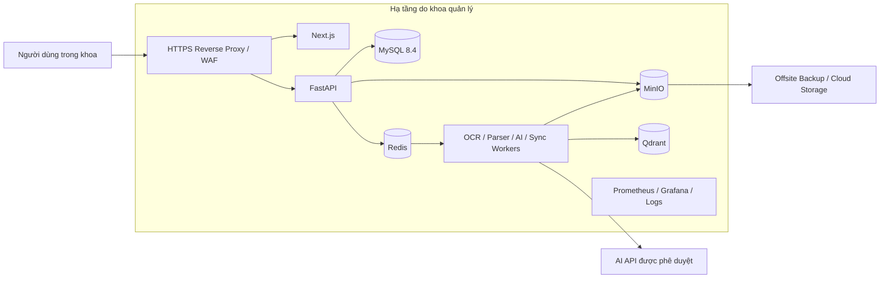

- Dữ liệu chính và quyền được vận hành tại hạ tầng của khoa.
- Chỉ gửi nội dung đến AI API khi policy của loại tài liệu cho phép.
- Secret và credential production không lưu trực tiếp trong source code hoặc log.
- Kết nối ra ngoài dùng TLS, giới hạn egress và ghi audit.

---

## 21. Công nghệ đề xuất

| Thành phần | Công nghệ đề xuất |
|---|---|
| Frontend | Next.js |
| Backend API | FastAPI |
| Database | MySQL 8.4 |
| Object Storage chính | MinIO |
| Vector Database | Qdrant |
| Cache / Queue | Redis |
| Worker | Celery hoặc RQ |
| OCR | PaddleOCR |
| Document Parser | Docling / parser chuyên định dạng |
| AI Agent | LangGraph |
| Embedding | BGE-M3 |
| Reranker | BGE-Reranker |
| Auth | OAuth2, SSO, LDAP |
| Monitoring | Prometheus + Grafana |
| Logging | ELK Stack |
| Deployment V2 | Docker Compose hoặc Docker trên server khoa |
| External services | AI API và offsite backup được phê duyệt |
| CI/CD | GitHub Actions |

---

## 22. Kiến trúc MVP đề xuất

Nếu triển khai cho một khoa trong giai đoạn đầu, nên tinh gọn như sau:

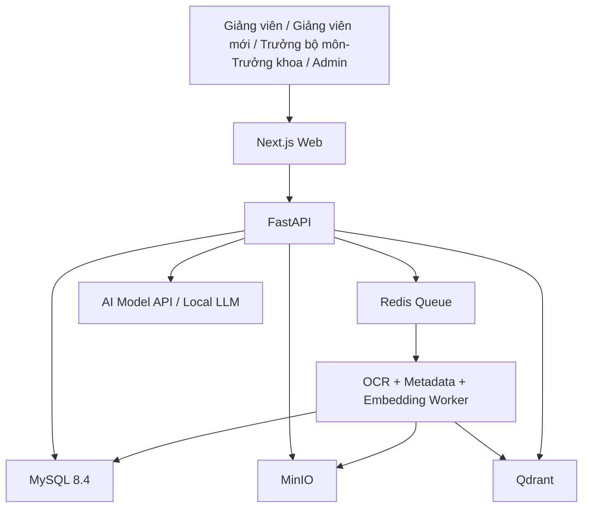

### MVP nên có

- Đăng nhập và phân quyền cơ bản.
- Upload tài liệu.
- OCR và trích xuất text.
- Tự động sinh metadata.
- Tìm kiếm tài liệu.
- AI Chat RAG có trích dẫn.
- Quản lý quyền truy cập.
- Audit log cơ bản.
- Backup định kỳ.
- Versioning, rollback và thùng rác.
- Tiếp nhận học phần/quy trình và chuyển giao tri thức.
- Policy lưu trữ, phân quyền và backup.
- Đồng bộ kho ngoài và kiểm tra tuân thủ 3-2-1.
- Báo cáo sử dụng và giám sát chất lượng kho.

### MVP chưa cần vội

- Kubernetes và multi-tenant.
- Graph Database.
- Quá nhiều Agent riêng biệt.
- Multi-cloud phức tạp.
- Workflow approval nhiều tầng.
- Recommendation nâng cao.

---

## 23. Roadmap triển khai

| Giai đoạn | Mục tiêu | Thành phần chính |
|---|---|---|
| Phase 1 — V2 Foundation | Chuyển MVP hiện tại sang hạ tầng V2 | MySQL 8.4, MinIO, Redis Queue, Qdrant, outbox |
| Phase 2 — V2 Functional Parity | Giữ toàn bộ chức năng bản cũ | Version, rollback, permission, handover, policy, backup, report |
| Phase 3 — Pilot | Dùng thật trong một khoa | OCR, metadata AI, SSO, monitoring, security scan |
| Phase 4 — Production Readiness | Đạt mục tiêu vận hành | RPO < 1 giờ, RTO < 4 giờ, restore drill, audit bất biến |
| Ngoài phạm vi V2 | Chỉ xem xét khi có yêu cầu mới | Multi-tenant, nhiều khoa, Kubernetes, billing SaaS |

---

## 24. Kết luận CTO

Bản thiết kế 10/10 cho EduVault không phải là bản có nhiều thành phần nhất, mà là bản có khả năng:

1. Giải quyết đúng nỗi đau của giảng viên: lưu trữ, tìm kiếm, hỏi đáp và chia sẻ tri thức.
2. Triển khai được cho một khoa với quy mô khoảng 100 GB.
3. Giữ đầy đủ toàn bộ chức năng của phiên bản cũ khi chuyển sang hạ tầng V2.
4. Có AI nhưng không lạm dụng AI.
5. Có bảo mật, phân quyền, audit và backup ngay từ đầu.
6. Có khả năng kiểm soát chi phí AI khi scale.

Kiến trúc phù hợp nhất là nâng cấp MVP hiện tại theo từng giai đoạn, giữ đủ chức
năng cũ và ưu tiên vận hành ổn định cho một khoa.
